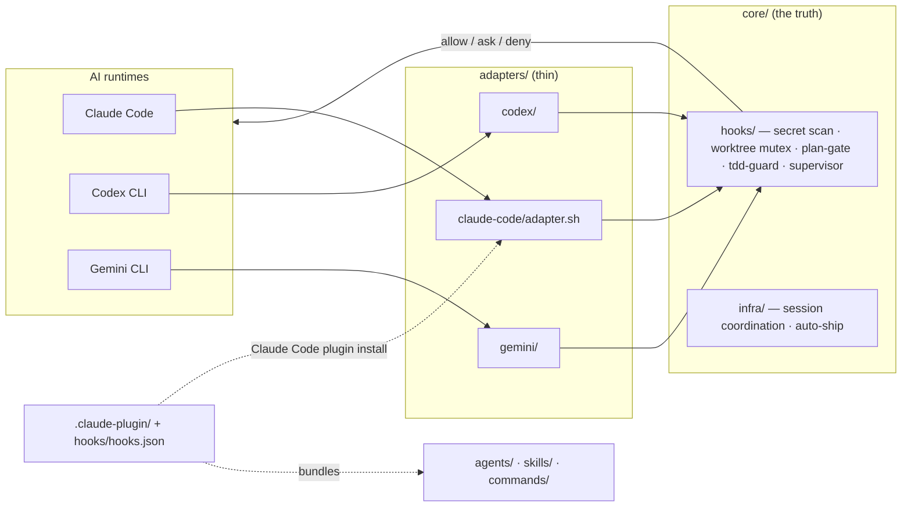

# Agent

[](LICENSE)


[English](README.md) | **한국어**

**Agent는 AI 코딩 에이전트를 위한 안전장치(하네스)입니다.** 등산용 하네스를 떠올려 보세요.
코드를 쓰고, 명령을 실행하고, PR을 여는 "등반"은 AI(Claude Code, Codex CLI, Gemini CLI)가
하고, 하네스는 추락을 막습니다 — 시크릿 커밋, 다른 AI 세션과의 충돌, 테스트 건너뛰기,
건드리면 안 되는 영역 접근을 구조적으로 차단합니다.

**Claude Code 플러그인**으로 한 번 설치하면(또는 셸 스크립트로 3개 CLI 모두) 모든
프로젝트에 같은 가드레일이 적용됩니다. 규칙은 한 번만 작성하고, 어떤 AI가 실행하든 같은
**allow / ask / deny** 답을 돌려줍니다.

> 상태: v0.2.5 · 라이선스: **MIT**

---

## 60초 개념 정리

이 분야가 처음이어도 아래 7개 용어만 알면 이 문서 전체를 읽을 수 있습니다.

| 용어 | 쉬운 뜻 |
|---|---|
| **하네스(harness)** | 에이전트 + 훅 + 스킬 + 규칙을 묶어 AI를 감싸는 안전 계층 전체. |
| **훅(hook)** | AI 런타임이 어떤 행동 전/후에 자동으로 실행하는 작은 스크립트. **allow**, **ask**, **deny** 중 하나로 답합니다. [`core/hooks/`](core/hooks/)에 20개가 있습니다. |
| **어댑터(adapter)** | 각 AI CLI의 고유 이벤트 형식과 하네스의 표준 JSON 사이를 번역하는 얇은 계층. 3개가 있습니다([`adapters/`](adapters/)). |
| **에이전트(agent)** | AI가 일을 위임하는 전문가 — 예: 리뷰만 하고 절대 코드를 쓰지 않는 보안 리뷰어. 2종이 포함됩니다([`agents/`](agents/)). |
| **스킬(skill)** | AI가 따라가는 재사용 가능한 단계별 워크플로우 — 예: 커밋+PR 자동화 흐름. 6종이 포함됩니다([`skills/`](skills/)). |
| **플랜 게이트(plan-gate)** | 프롬프트를 분류해서, 위험한 다단계 작업 전에 반드시 계획서를 쓰게 강제하는 훅. |
| **뮤텍스(mutex)** | 두 AI 세션이 같은 위험 영역(운영 DB, 배포, 결제)을 동시에 건드리지 못하게 하는 잠금 파일. |

더 깊은 설명: [`docs/concepts/`](docs/concepts/).

## 무엇을 얻게 되나

1. **멀티 세션 안전** — 한 터미널엔 Claude, 다른 터미널엔 Codex를 띄워도 충돌하지 않습니다. 공유 자원 잠금은 하나의 JSON 잠금 파일로 조정됩니다.
2. **시크릿 방어** — 6겹 방어(`gitleaks` 설정 + pre-commit + pre-push + Bash/MCP 내용 스캐너 + 정책 문서 + CI). 코드·env 파일·MCP 도구 호출·push diff에서 OpenAI/Anthropic/AWS/Stripe/Slack/Supabase + 커스텀 토큰을 잡아냅니다.
3. **계획 우선 규율** — 훅이 프롬프트를 티어(trivial / interactive / autonomous / conversational)로 분류하고, 파괴적 작업은 계획 뒤로 게이트합니다.
4. **TDD 강제** — `tdd-guard`가 대응 테스트 파일 없는 새 프로덕션 코드 생성을 차단합니다.
5. **정책 강제** — 기여 규칙, 공개 레포 안전, 메모리 규율, 워크트리 조정, 설정 가능한 위험 영역 5종을 다루는 범용 정책 문서.
6. **워크트리 조정** — `core/infra/agent-session.sh`로 브랜치-단위 작업 규율 + 오래된 세션 자동 정리 + 하트비트.
7. **커밋 + PR 자동화** — `auto-ship.sh`가 gitleaks + 위험 영역 검사 + CI 감시 + 머지를 한 번에 실행. 안전장치 하나라도 걸리면 중단.
8. **크로스-AI 동일성** — 같은 `core/hooks/*` 스크립트가 3개 AI 모두에서 같은 결정을 돌려줍니다.

## 사전 요구사항

필수:

- `git` 2.30+
- `bash` 5.0+ (macOS 기본은 3.2 — `brew install bash`)
- `python3` 3.9+ (훅 여러 개가 Python 스크립트)
- AI CLI 최소 1개: [Claude Code](https://claude.com/claude-code), Codex CLI, Gemini CLI

선택:

- `gitleaks` 8+ — 시크릿 스캔. 없으면 훅은 시크릿 스캔 단계를 건너뜁니다(CI에서는 여전히 강제).
- `gh` 2.0+ — 레포 작업과 `auto-ship.sh`용.

`bash setup.sh --doctor`로 위 항목 + 훅/어댑터 실행권한 + 레지스트리 정합성을 언제든
점검할 수 있습니다 — 읽기 전용, 설치 부작용 없음.

## 빠른 시작

설치 경로는 두 가지 — 둘 다 같은 코어를 설치합니다:

| 당신이… | 선택 |
|---|---|
| Claude Code를 쓴다 | **Path A** — 플러그인 (약 1분) |
| Codex CLI / Gemini CLI도(또는 만) 쓴다, 혹은 플러그인 시스템이 싫다 | **Path B** — 셸 설치 |

잘 모르겠으면 Path A를 선택하세요.

### Path A — Claude Code 플러그인 (권장)

```
/plugin marketplace add joymin5655/Agent
/plugin install agent-harness@agent
```

그 다음:

1. **Claude Code 재시작.** 에이전트와 훅은 세션 시작 시 로드됩니다.
2. **확인.** `/plugin` 실행 — `agent-harness`가 *enabled*로 표시됩니다. 새 세션에서 에이전트가 `agent-harness:code-reviewer`, `agent-harness:security-reviewer`로 조회되고 `/project-init`이 사용 가능합니다.
3. **프로젝트 스캐폴드.** 아무 레포 안에서 `/project-init`을 실행하면 `CLAUDE.md`, 규칙, `gitleaks.toml`이 생성됩니다.
4. *(선택)* 훅이 많은 다른 플러그인이 이미 도는 레포에서는 `/plugin`으로 agent-harness만 그 레포에서 끄세요 — 에이전트는 `agent-harness:*`로 네임스페이스가 분리되어 있어 어느 쪽이든 이름 충돌은 없습니다.

플러그인 번들: **에이전트 2종**, **스킬 6종**, 훅 세트, `/project-init` 명령.

### Path B — 셸 설치 (Codex CLI / Gemini CLI / 3개 모두)

```bash
gh repo clone joymin5655/Agent ~/agent   # or: git clone https://github.com/joymin5655/Agent ~/agent
bash ~/agent/setup.sh                    # no flag = all three AIs
```

| 플래그 | 설치 대상 |
|---|---|
| `--claude` | Claude Code만 (`~/.claude/settings.json`) |
| `--codex` | Codex CLI만 (`~/.codex/config.toml`) |
| `--gemini` | Gemini CLI만 (`~/.gemini/settings.json`) |
| `--project` | 현재 레포 스캐폴드: `CLAUDE.md` / `AGENTS.md` / `GEMINI.md` / `gitleaks.toml` / `hook-config.yml` / git pre-commit + pre-push 훅 |
| `--hooks-only` | git-hooks만, AI 설정 없음 |
| `--all` | 위 전부 |

플래그는 조합 가능합니다(`bash setup.sh --claude --project`). 멱등(idempotent) — 기존
파일은 건너뛰고, 교체가 필요하면 대화형으로 물어봅니다. 비대화 실행은
`AGENT_SETUP_YES=1`을 설정하세요. `--force` 플래그는 없습니다.

## 동작 보기

AI에게 `secrets/` 아래 파일을 읽어 달라고 하면:

```
🚫 Tool blocked: Direct secrets/ access blocked. Use environment variable.
```

이 차단이 Claude Code, Codex CLI, Gemini CLI에서 똑같이 발동합니다 — 같은 스크립트, 같은
결정. 그게 이 프로젝트의 핵심입니다.

## 아키텍처

표준 훅 프로토콜은 하나, AI별 얇은 어댑터가 고유 이벤트를 그 프로토콜로 번역합니다.
가드는 `core/hooks/`에 한 번만 작성하면 어디서든 같은 `allow` / `ask` / `deny`를 돌려줍니다.



4개 계층, 결정은 가장 낮은 계층이 우선합니다:

- **L1 `core/`** — AI 불가지(agnostic) 훅과 인프라. 단일 진실 원천.
- **L2 `adapters/`** — AI별 번역기 (claude-code는 얇은 통과, codex·gemini는 실제 번역 수행).
- **L3 `templates/`** — `setup.sh --project` / `/project-init`이 복사해 넣는 프로젝트 스캐폴드.
- **L4 프로젝트** — `hook-config.yml`과 선택적 `.agent/` 파일로 오버라이드. 코어 수정 불필요.

**Claude Code 플러그인**(`.claude-plugin/`)은 같은 코어를 `hooks/hooks.json`으로 연결하고
에이전트/스킬/명령을 번들합니다 — `/plugin install` 하나로 하네스 전체가 설치됩니다.

## 카탈로그

| 에이전트 (`agents/`) | 모델 | 모드 | 역할 |
|---|---|---|---|
| `code-reviewer` | sonnet | read-only | diff 리뷰; 보안 이슈는 security-reviewer에 위임 |
| `security-reviewer` | opus | read-only | OWASP Top 10, 시크릿, 인증, 인젝션 — 보안 발견 전담 |

모델은 작업 클래스별 비용 티어로 배정됩니다([`docs/model-routing.md`](docs/model-routing.md)가
크로스런타임 정본): 판단(계획·오케스트레이션 결정·결과 종합)은 세션 최상위 모델 상속(`model:` 핀
없음), 위 리뷰어 2핀은 `agents/master-registry.json`과의 일치가 CI 드리프트 가드로 검증되는
**유일한 기계 강제 지점**, 구현은 워크호스 티어·기계적 작업은 LOW 티어로 호출 시 명시 `model`
오버라이드 디스패치 — 문서화된 convention입니다.
read-only 에이전트는 도구 수준에서 강제됩니다(`Write`/`Edit`/`Bash` 없음). 프로젝트별
특화는 `.agent/` 파일로 — [`docs/specializing-agents.md`](docs/specializing-agents.md) 참조.

| 스킬 (`skills/`) | 트리거 |
|---|---|
| `spec` | 상류 계획 규율 — 위험 작업 전 아이디어→리뷰 가능한 스펙 (spec-gate 훅과 짝) |
| `supervise` | 계획을 자율 실행에 위임 |
| `verify-completion` | 완료 주장 독립 재검증 (결정적 체크 + refute-by-default judge) |
| `wrap` | 안전장치를 갖춘 커밋 + PR 자동화 |
| `harness-audit` | 하네스 자체의 읽기전용 건강 점검 (`verify-all.sh` 1회 드라이런 해석) |
| `harness-help` | 라우터 — 상황에 맞는 스킬과 main flow 안내 |

| 훅 — 20개, `hooks/hooks.json` → `core/hooks/` 연결 | 이벤트 |
|---|---|
| secret-content-scan · check-hardcoding | PreToolUse (Write/Edit) |
| pre-tool-guard · r4-mutex · context-mode-guard | PreToolUse |
| tdd-guard · spec-gate · supervisor · plan-scope-allow | PreToolUse (Write/Edit) |
| session heartbeat | UserPromptSubmit |
| plan-gate · model-routing-observer | PostToolUse (ExitPlanMode/Task/Agent) |
| session-quality-gate · session-close | Stop |

명령: **`/project-init`** — 프로젝트 파일(`CLAUDE.md`, 규칙, `gitleaks.toml`) 스캐폴드.

## 디렉터리 구조

```
Agent/
├── .claude-plugin/     # Claude Code plugin + marketplace manifests
├── setup.sh            # shell installer — 6 combinable flags
├── gitleaks.toml       # base secret-scan config
├── AGENTS.md           # operating rules for AIs working on this repo
├── CHANGELOG.md
│
├── agents/             # 2 agent definitions + master-registry.json
├── skills/             # 6 skills (spec · supervise · verify-completion · wrap · harness-audit · harness-help)
├── commands/           # 1 slash command (/project-init)
├── hooks/              # plugin hook wiring (hooks.json)
│
├── core/               # AI-agnostic core — the truth
│   ├── hooks/          #   20 portable hooks + hook_config.py (shared module)
│   ├── infra/          #   session coordination · auto-ship · goal mode
│   ├── git-hooks/      #   pre-commit · pre-push
│   └── tests/          #   4 test scripts
│
├── adapters/           # claude-code (thin) · codex · gemini
├── rules/              # generic policy docs
├── templates/          # project scaffold templates
├── docs/               # architecture · protocol · guides · benchmark
├── github/             # PR template + workflow templates
└── legacy/             # retired snapshots (out of scope)
```

## 왜 "AI 불가지(AI-agnostic)"인가?

훅 프로토콜 하나, 어댑터 셋:

```
 [AI runtime]  Claude / Codex / Gemini
      │  native hook event
      ▼
 [adapter]  translates to canonical stdin JSON
      ▼
 [core/hooks/<name>]  decides once
      ▼
 [adapter]  translates back to the AI's native format
      ▼
 [AI runtime enforces]  allow / ask / deny
```

한 번 작성한 `pre-tool-guard.sh`가 3개 AI 모두에서 동작합니다. 새 AI 런타임을 추가할 때는
어댑터 하나만 새로 쓰면 되고 `core/hooks/*`는 바뀌지 않습니다.
표준 이벤트 스키마: [`docs/hook-protocol.md`](docs/hook-protocol.md). AI/모델마다 무엇이
동일하게 보장되고(게이트) 무엇은 아닌지(생성된 콘텐츠) 정확한 설명은 아키텍처 문서의
[Determinism and model-invariance](docs/architecture.md#determinism-and-model-invariance)
절을 참고하세요.

## 벤치마크

**심어둔 버그 8개** 픽스처로 자체 벤치마크를 돌리고, 독립된 opus 심판이 블라인드 채점한
결과:

| 스택 | 검출 | 오탐 |
|---|---|---|
| **agent-harness** (`code-reviewer` + `security-reviewer`) | **8/8** | **0** |
| **oh-my-claudecode** (번들 `code-reviewer`) | **8/8** | 1 (완곡) |

정직하게 읽으면 사실상 무승부입니다. 큐레이션된 2-에이전트 조합이 더 깨끗했고(오탐 0)
역할 분리도 지켜졌지만, OMC의 넓은 스윕은 이쪽 레인이 놓친 진짜 결함 2건을 더 찾았습니다.
한 줄 포지셔닝: 이 하네스는 오탐 없는 얇은 품질+거버넌스 레인이고, 롱테일은 더 넓은
스택에 위임합니다. 전체 방법론과 원자료: [`docs/benchmark/results.md`](docs/benchmark/results.md).

## 이것이 아닌 것

- **배포 가능한 애플리케이션이 아닙니다** — 여러분의 프로젝트에 채택하는 프레임워크입니다.
- **AI 런타임이 아닙니다** — AI(Claude Code, Codex, Gemini 등)는 직접 준비하세요.
- **`.claude/`의 대체물이 아닙니다** — `.claude/`, `.codex/`, `.gemini/` 설정을 생성·보완합니다.
- **여러분의 코드에 간섭하지 않습니다** — 세션 조정, 시크릿 위생, 정책 강제만 다룹니다. 스택·언어·아키텍처는 여러분의 선택입니다.

## 검증

```bash
# 1) gitleaks runs clean
gitleaks detect --no-git --source . --config gitleaks.toml

# 2) domain-neutrality gate (also runs in CI)
bash core/tests/sanitize-audit.sh

# 3) cross-AI parity: same event → same decision across all 3 adapters
bash core/tests/adapter-parity.sh
# → === Parity results: 6 passed, 0 failed ===

# 4) config parsing + autosync hook
bash core/tests/hook-config-test.sh
bash core/tests/post-commit-autosync-test.sh

# 5) environment diagnosis — read-only, no installs
bash setup.sh --doctor
```

## 커스터마이즈

`setup.sh --project`가 프로젝트의 정책 형태를 문서화하는 `hook-config.yml`을 스캐폴드합니다:

```yaml
risk_areas:
  - id: data
    description: "Production database migrations and schema changes"
    paths: ["migrations/*.sql"]
    commands: ["psql.*production", "alembic upgrade"]
    decision: ask
  - id: secrets
    description: "Anything touching secrets/ or .env"
    paths: ["secrets/*", ".env*"]
    decision: deny
  # ... add your own
```

이 `risk_areas:` 블록은 선언적입니다 — 프로젝트 정책을 기록한 문서일 뿐입니다. 현재
실제 강제는 각 훅 스크립트에 하드코딩된 패턴(`core/hooks/pre-tool-guard.sh`,
`core/hooks/r4-mutex-check.sh`)이 수행하며, 이 파일을 동적으로 읽지는 않습니다.
프로젝트마다 실제로 동적 로드되는 유일한 메커니즘은 `.agent/hook-config.yml`을 통한
secret-scan 패턴 확장입니다. 전체 스키마와 실제-대-문서 간극:
[`docs/customization.md`](docs/customization.md). 번들 에이전트를 포크 없이 프로젝트에
맞게 벼리려면 `.agent/`에 선택 파일을 놓으세요 —
[`docs/specializing-agents.md`](docs/specializing-agents.md) 참조.

## 문서

- [`docs/getting-started.md`](docs/getting-started.md) — 5분 설치 안내
- [`docs/architecture.md`](docs/architecture.md) — 4계층 모델 상세
- [`docs/hook-protocol.md`](docs/hook-protocol.md) — 표준 이벤트 스키마 (커스텀 훅 작성)
- [`docs/customization.md`](docs/customization.md) — 위험 영역과 프로젝트별 설정
- [`docs/specializing-agents.md`](docs/specializing-agents.md) — 프로젝트별 에이전트 특화
- [`docs/model-routing.md`](docs/model-routing.md) — 크로스런타임 모델 티어 정책 (판단 vs 실행, floor)
- [`docs/benchmark/results.md`](docs/benchmark/results.md) — 리뷰어 자체 벤치마크
- [`docs/benchmark/landscape.md`](docs/benchmark/landscape.md) — 인기 하네스 대비 서베이 + gap→backlog 매핑
- [`docs/harness-improvement-plan.md`](docs/harness-improvement-plan.md) — 점검 + 개선 로드맵 *(한국어)*
- 2026-05 이전 미러 버전에서 이전하려면: v0 미러는 0.2.9에서 배포 트리를 떠났다(은퇴한 에이전트 프로바이더가 ghost-specialist 트랩이었다). `archive/v0-mirror` 태그에 보존됨: `git show archive/v0-mirror:legacy/v0-mirror-2026-05-12/ARCHIVE-NOTE.md`

## 기여

[`docs/getting-started.md`](docs/getting-started.md)와 [`rules/contributing.md`](rules/contributing.md)를 참조하세요.

## 라이선스

[MIT](LICENSE) © joymin ([@joymin5655](https://github.com/joymin5655)).

---

*영문 [README.md](README.md)가 원문 기준이며, 한국어판은 이를 따라 갱신됩니다.*
