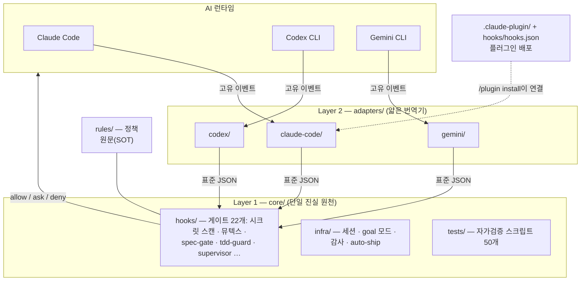
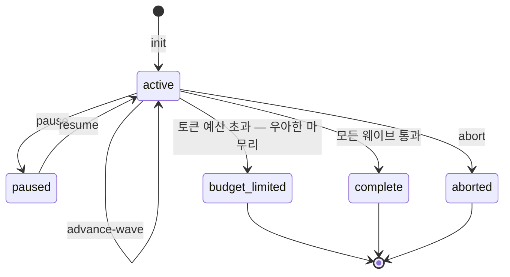
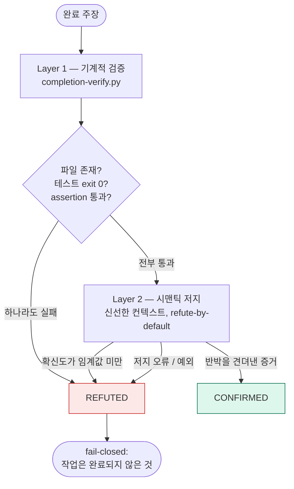
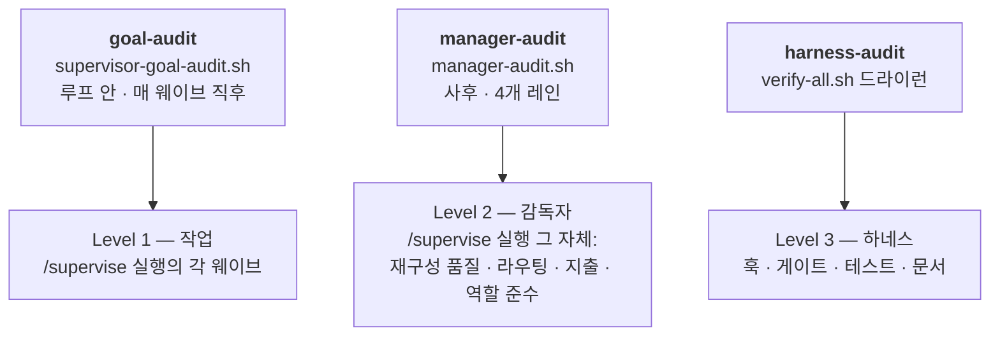

# Agent

[](LICENSE)


[English](README.md) | **한국어**

**Agent는 AI 코딩 에이전트를 위한 안전장치(하네스)입니다.** 등산용 하네스를 떠올려 보세요.
코드를 쓰고, 명령을 실행하고, PR을 여는 "등반"은 AI(Claude Code, Codex CLI, Gemini CLI)가
하고, 하네스는 추락을 막습니다 — 시크릿 커밋, 다른 AI 세션과의 충돌, 테스트 건너뛰기,
건드리면 안 되는 영역 접근을 구조적으로 차단합니다.

**Claude Code 플러그인**으로 한 번 설치하면(또는 셸 스크립트로 3개 CLI 모두) 모든
프로젝트에 같은 결정 코어가 적용됩니다. 규칙은 한 번만 작성하고, 이벤트가 코어에
도달하면 어떤 AI가 실행하든 같은 **allow / ask / deny** 답을 돌려줍니다 —
`core/tests/adapter-parity.sh`가 기계로 증명합니다. 런타임마다 다른 것은 CLI 활동 중
얼마나 많은 부분이 그 코어에 도달하는가입니다 — [런타임 커버리지](#런타임-커버리지) 참고.

> 상태: v0.5.1 · 라이선스: **MIT**

---

## 파이프라인

하나의 아이디어가 다섯 개의 스킬을 통과합니다. 각 단계 사이에는 **기계 게이트**(아래
육각형)가 서 있습니다 — "권유하는 프롬프트"가 아니라 실제로 차단하는 스크립트입니다.

```mermaid
flowchart LR
    IDEA(["아이디어 /<br/>요청"]) --> SPEC["<b>/spec</b><br/>브레인스토밍 →<br/>spec.md + plan.md"]
    SPEC --> G1{{"spec-gate.py<br/>승인된 플랜 없이는<br/>실질적 편집 차단"}}
    G1 --> SUP["<b>/supervise</b><br/>웨이브 단위로<br/>전문 에이전트에 디스패치"]
    SUP --> G2{{"supervisor-goal-audit.sh<br/>매 웨이브 감사<br/>FAIL = 정지, 자동 재시도 없음"}}
    G2 --> VER["<b>/verify-completion</b><br/>기계적 검증 +<br/>refute-by-default 저지"]
    VER --> G3{{"gitleaks +<br/>risk-area 게이트"}}
    G3 --> WRAP["<b>/wrap</b><br/>커밋 + PR"]
    WRAP -.-> MA["<b>/manager-audit</b><br/>사후 감사: 감독자가<br/>일을 제대로 했는가?"]
    MA -.-> PROP(["PROPOSALS.md<br/>패치 제안은<br/>사용자 승인 대기"])

    style G1 fill:#fdf6b2,stroke:#b45309
    style G2 fill:#fdf6b2,stroke:#b45309
    style G3 fill:#fdf6b2,stroke:#b45309
```



각 단계의 상세: [`skills/`](skills/) · 상태머신과 감사 내부 구조는 아래
[실행 흐름 심화](#실행-흐름-심화) 참고.

## 왜 이 하네스인가

기본기부터: 멀티세션 뮤텍스, 6-계층 시크릿 방어, TDD 강제는 전부 들어 있습니다
([카탈로그](#카탈로그) 참고). 이 하네스를 실제로 구별 짓는 것은:

**Gates, not vibes** — 강제는 프롬프트 문구가 아니라 툴 경계에 있습니다.

- `core/hooks/pre-tool-guard.sh`가 툴 경계에서 편집과 명령을 물리적으로 차단합니다.
  AI가 말로 설득해서 통과할 수 없습니다.
- `core/hooks/spec-gate.py`와 `core/hooks/tdd-guard.py`는 같은 종류의 게이트지만 기본은
  **관찰 모드**입니다: `AGENT_SPEC_GATE_MODE` / `AGENT_TDD_GUARD_MODE`가
  `off | dryrun | block`을 받고, 기본값 `dryrun`은 차단했을 판정을 로그로만 남깁니다.
  강제하려면 `block`으로 설정하세요.
- 완료 주장은 **refute-by-default**로 검증됩니다: 기계 검증 + 시맨틱 저지 이중 구조로,
  낮은 확신도는 물론 저지 크래시조차 전부 REFUTED로 수렴합니다(fail-closed) —
  [검증 다이어그램](#실행-흐름-심화) 참고.
- Cross-AI 동일성은 약속이 아니라 기계 증명입니다: `core/tests/adapter-parity.sh`가
  같은 이벤트를 3개 어댑터에 흘려 동일한 결정을 assert합니다. 이것이 증명하는 것은
  *결정* 동일성입니다. 런타임별 *이벤트 커버리지*는 다릅니다 —
  [런타임 커버리지](#런타임-커버리지) 참고.

**하네스가 하네스를 게이트한다** — 모든 강제 계층은 다른 계층이 감시합니다.

- [`docs/gate-registry.md`](docs/gate-registry.md)는 게이트마다 *그 게이트가 가정하는
  모델 약점*과 리뷰 날짜를 기록하고, 가정이 만료되면 DEAD / FATIGUE / STALE로
  판정합니다 — 게이트 자체가 게이트됩니다.
- 세 고도의 감사 3중 구조: goal-audit은 웨이브를, manager-audit은 감독자를,
  harness-audit은 하네스 자체를 검사합니다 — [감사 다이어그램](#실행-흐름-심화) 참고.
- 이 README는 CI가 검증합니다: `core/tests/doc-reality.sh`는 문서가 존재하지 않는 파일을
  언급하면 빌드를 실패시킵니다. 문서는 거짓말할 수 없습니다.

**정직한 경제학** — 비용과 한계를 감추지 않고 설계에 넣었습니다.

- 모델 티어 라우팅([`docs/model-routing.md`](docs/model-routing.md)): LOW / MID / TOP +
  "effort before tier-up" 원칙 — 런타임 모델 스위칭을 *거부한* 결정 자체도 이유와 함께
  문서화되어 있습니다.
- Goal 모드는 세션이 죽어도 살아남습니다: SQLite 상태머신
  (`core/infra/supervisor-goal.sh`)이 웨이브와 토큰 예산을 추적하고, 멈춘 지점에서
  정확히 재개합니다 — 예산 초과 시에도 `budget_limited`로 우아하게 마무리합니다.
- [셀프 벤치마크](#벤치마크)는 경쟁 스택과의 "사실상 무승부"를 스스로 인정합니다.
  정직한 감사 로그가 마케팅 페이지를 이깁니다.

## 60초 개념 정리

이 분야가 처음이어도 아래 10개 용어만 알면 이 문서 전체를 읽을 수 있습니다.

| 용어 | 쉬운 뜻 |
|---|---|
| **하네스(harness)** | 에이전트 + 훅 + 스킬 + 규칙을 묶어 AI를 감싸는 안전 계층 전체. |
| **훅(hook)** | AI 런타임이 어떤 행동 전/후에 자동으로 실행하는 작은 스크립트. **allow**, **ask**, **deny** 중 하나로 답합니다. [`core/hooks/`](core/hooks/)에 22개(+공유 모듈 2개)가 있습니다. |
| **어댑터(adapter)** | 각 AI CLI의 고유 이벤트 형식과 하네스의 표준 JSON 사이를 번역하는 얇은 계층. 3개가 있습니다([`adapters/`](adapters/)). |
| **에이전트(agent)** | AI가 일을 위임하는 전문가 — 예: 리뷰만 하고 절대 코드를 쓰지 않는 보안 리뷰어. 2종이 포함됩니다([`agents/`](agents/)). |
| **스킬(skill)** | AI가 따라가는 재사용 가능한 단계별 워크플로우 — 예: 커밋+PR 자동화 흐름. 8종이 포함됩니다([`skills/`](skills/)). |
| **게이트(gate)** | 훅의 결정 지점(deny / ask / block). 모든 게이트는 자신이 가정하는 모델 약점과 함께 등록됩니다 — [`docs/gate-registry.md`](docs/gate-registry.md). |
| **웨이브(wave)** | `/supervise` 플랜 안의 작업 묶음 하나 — 디스패치·실행·감사를 마쳐야 다음 웨이브가 시작됩니다. |
| **판정(verdict)** | 모든 검증기가 뱉는 공용 CONFIRMED / REFUTED 결과 스키마 — [`docs/scoring-convention.md`](docs/scoring-convention.md). |
| **플랜 게이트(plan-gate)** | 프롬프트를 분류해서, 위험한 다단계 작업 전에 반드시 계획서를 쓰게 강제하는 훅. |
| **뮤텍스(mutex)** | 두 AI 세션이 같은 위험 영역(운영 DB, 배포, 결제)을 동시에 건드리지 못하게 하는 잠금 파일. |

더 깊은 설명: [`docs/concepts/`](docs/concepts/).

## 런타임 커버리지

결정 동일성은 코어에서 증명됩니다: 같은 이벤트는 어떤 런타임에서든 같은 판정을 받습니다.
반면 이벤트 *커버리지* — 각 CLI의 활동 중 얼마나 많은 부분이 그 코어를 거치는가 — 는
동일하지 **않습니다**. 정직한 표는 다음과 같습니다:

| 능력 | Claude Code | Codex CLI | Gemini CLI |
|---|---|---|---|
| PreToolUse: 셸 명령 | 네이티브 훅 | 셸 래퍼 | 셸 래퍼 |
| PreToolUse: 네이티브 파일 쓰기 도구 | 네이티브 훅 | 미가로채기 | 미가로채기 |
| PostToolUse | 네이티브 훅 | 없음 | 없음 |
| 세션 라이프사이클 | 네이티브 훅 | 시뮬레이션 (`core/infra/codex-session.sh`) | 시뮬레이션 (`core/infra/gemini-session.sh`) |

런타임별 상세와 우회 방법:
[`adapters/codex/README.md`](adapters/codex/README.md) ·
[`adapters/gemini/README.md`](adapters/gemini/README.md).

## 사전 준비물

필수:

- `git` 2.30+
- `bash` 5.0+ (macOS 기본은 3.2 — `brew install bash`)
- `python3` 3.9+ (여러 훅이 Python 스크립트)
- AI CLI 최소 1개: [Claude Code](https://claude.com/claude-code), Codex CLI, Gemini CLI

선택:

- `gitleaks` 8+ — 시크릿 스캔. 없으면 훅은 시크릿 스캔 단계를 건너뜁니다(CI는 여전히 강제).
- `gh` 2.0+ — 저장소 작업과 `auto-ship.sh`용.
- `sqlite3` + `jq` — `/supervise --goal-mode` 전용 필수
  (`core/infra/supervisor-goal.sh`가 없으면 에러로 종료; macOS는 sqlite3 기본
  탑재, Debian/Ubuntu는 `apt install sqlite3 jq`). manager-audit 토큰 레인은
  없어도 우아하게 축소 동작합니다.

언제든 `bash setup.sh --doctor`로 위 목록 + 훅/어댑터 실행권한 + 레지스트리 정합성을
확인할 수 있습니다 — 읽기 전용, 아무것도 설치하지 않습니다.

## 빠른 시작

설치 경로는 2가지 — 어느 쪽이든 같은 코어가 연결됩니다:

| 당신이… | 선택 |
|---|---|
| Claude Code 사용자라면 | **Path A** — 플러그인 (약 1분) |
| Codex CLI / Gemini CLI도(또는 만) 쓰거나, 플러그인 시스템이 싫다면 | **Path B** — 셸 설치 |

잘 모르겠으면 Path A.

### Path A — Claude Code 플러그인 (권장)

```
/plugin marketplace add joymin5655/Agent
/plugin install agent-harness@agent
```

그 다음:

1. **Claude Code를 재시작합니다.** 에이전트와 훅은 세션 시작 시 로드됩니다.
2. **확인합니다.** `/plugin` 실행 — `agent-harness`가 *enabled*로 표시됩니다. 새 세션에서 에이전트가 `agent-harness:code-reviewer`, `agent-harness:security-reviewer`로 resolve되고 `/project-init`을 쓸 수 있습니다.
3. **프로젝트를 스캐폴드합니다.** 아무 저장소에서 `/project-init`을 실행하면 `CLAUDE.md`, 규칙, `gitleaks.toml`이 생성됩니다.
4. *(선택)* 훅이 많은 다른 플러그인을 쓰는 저장소에서는 `/plugin`으로 agent-harness를 꺼도 됩니다 — 에이전트는 `agent-harness:*` 네임스페이스라 어느 쪽이든 충돌하지 않습니다.

플러그인에 포함: **에이전트 2종**, **스킬 8종**, 훅 세트, `/project-init` 커맨드.

### Path B — 셸 설치 (Codex CLI / Gemini CLI / 3개 전부)

```bash
gh repo clone joymin5655/Agent ~/agent   # 또는: git clone https://github.com/joymin5655/Agent ~/agent
bash ~/agent/setup.sh                    # 플래그 없음 = 3개 AI 전부
```

| 플래그 | 설치 대상 |
|---|---|
| `--claude` | Claude Code만 (`~/.claude/settings.json`) |
| `--codex` | Codex CLI만 (`~/.codex/config.toml`) |
| `--gemini` | Gemini CLI만 (`~/.gemini/settings.json`) |
| `--project` | 현재 저장소 스캐폴드: `CLAUDE.md` / `AGENTS.md` / `GEMINI.md` / `gitleaks.toml` / `hook-config.yml` / git pre-commit + pre-push 훅 |
| `--hooks-only` | git-hooks만, AI 설정 없음 |
| `--all` | 위 전부 |

플래그는 조합 가능합니다(`bash setup.sh --claude --project`). 멱등 — 기존 파일은
건너뛰고, 교체가 필요하면 대화형으로 물어봅니다. 비대화형 실행은 `AGENT_SETUP_YES=1`.
`--force` 플래그는 없습니다.

## 동작 확인

AI에게 `secrets/` 아래 파일을 읽어 달라고 해보세요:

```
🚫 Tool blocked: Direct secrets/ access blocked. Use environment variable.
```

이 차단은 Claude Code, Codex CLI, Gemini CLI에서 똑같이 발동합니다 — 같은 스크립트,
같은 결정. 그게 이 프로젝트의 핵심입니다.

## 아키텍처

표준 훅 프로토콜은 하나뿐이고, AI별 얇은 어댑터가 고유 이벤트를 그 프로토콜로 번역합니다.
`core/hooks/`에 가드를 한 번 작성하면 어디서든 같은 `allow` / `ask` / `deny` 결정을
돌려줍니다.



4개 계층, 가장 아래가 이깁니다:

- **L1 `core/`** — AI 무관(agnostic) 훅과 인프라. 단일 진실 원천.
- **L2 `adapters/`** — AI별 번역기 (claude-code는 얇은 통과, codex/gemini는 실제 번역).
- **L3 `templates/`** — `setup.sh --project` / `/project-init`이 복사하는 프로젝트 스캐폴드.
- **L4 당신의 프로젝트** — `hook-config.yml`과 선택적 `.agent/` 파일로 오버라이드. 코어 수정 불필요.

`pre-tool-guard.sh`를 한 번 작성하면 3개 AI 전부에서 작동합니다. 새 AI 런타임 추가 =
어댑터 하나 새로 쓰기 — `core/hooks/*`는 바뀌지 않습니다.
표준 이벤트 스키마는 [`docs/hook-protocol.md`](docs/hook-protocol.md), AI/모델을 넘어
정확히 무엇이 동일하게 보장되는지(게이트)와 무엇은 아닌지(생성 콘텐츠)는
[Determinism and model-invariance](docs/architecture.md#determinism-and-model-invariance)
참고.

## 실행 흐름 심화

한 번은 봐둘 만한 내부 구조 3가지. 클릭하면 펼쳐집니다.

<details>
<summary><b>Goal 모드 — 세션이 죽어도 살아남는 실행</b> (SQLite 상태머신)</summary>

`/supervise <slug> --goal-mode`는 실행을 SQLite 상태머신
(`core/infra/supervisor-goal.sh`)으로 백업합니다. 실행 중에 터미널을 죽이고 내일 돌아와
`resume`하면 — 멈췄던 바로 그 웨이브에서 이어집니다. 토큰 예산은 실행 단위로 추적되고,
예산 초과 시 크래시가 아니라 우아한 마무리가 발동합니다.



정책: [`rules/policy/supervisor-goal-mode.md`](rules/policy/supervisor-goal-mode.md).

</details>

<details>
<summary><b>검증 — refute-by-default, fail-closed</b> (2계층, 모든 REFUTED 경로가 수렴)</summary>

"완료"는 두 계층을 통과하기 전까지는 주장일 뿐입니다. Layer 1은 결정론적
(`core/infra/completion-verify.py`), Layer 2는 **신선한 컨텍스트**에서 스폰되는 시맨틱
저지로, 기본 판정이 REFUTED입니다. 확신도가 낮아도 REFUTED. 저지가 크래시해도 REFUTED.
애매한 것은 절대 CONFIRMED가 되지 않습니다.



판정은 [`docs/scoring-convention.md`](docs/scoring-convention.md)의 공용 스키마를
사용합니다 — 완료 검증기, goal-audit 스코어러, eval 하네스가 모두 한 포맷으로 말합니다.

</details>

<details>
<summary><b>3중 감사 — 감사자를 누가 감사하는가</b> (세 감사, 세 고도)</summary>

각 감사는 *서로 다른* 계층을 감시합니다 — 어떤 계층도 자기 숙제를 자기가 채점하지
않습니다.



그리고 게이트 자신도 늙습니다: [`docs/gate-registry.md`](docs/gate-registry.md)는
게이트가 겨냥했던 모델 약점이 사라지면 그 게이트를 DEAD / FATIGUE / STALE로 표시합니다.
manager-audit의 발견은 절대 스스로 적용되지 않습니다 — `PROPOSALS.md`에 제안으로 남아
사용자 승인을 기다립니다.

</details>

## 카탈로그

| 에이전트 (`agents/`) | 모델 | 모드 | 역할 |
|---|---|---|---|
| `code-reviewer` | sonnet | 읽기 전용 | diff 리뷰; 보안 사안은 security-reviewer에 위임 |
| `security-reviewer` | opus | 읽기 전용 | OWASP Top 10, 시크릿, 인증, 인젝션 — 보안 발견 전담 |

모델은 작업 등급별 비용 티어를 따릅니다([`docs/model-routing.md`](docs/model-routing.md)가 크로스 런타임 정책): 판단(judgment) — 계획, 오케스트레이션 결정, 결과 종합 — 은 세션 최상위 모델을 상속하고(`model:` 핀 없음), 위 두 리뷰어의 핀은 CI 드리프트 가드가 `agents/master-registry.json`과 동기화합니다(기계 강제되는 유일한 부분). 구현 디스패치는 워크호스 티어, 기계적 작업은 로우 티어로 — 호출별 `model` 오버라이드를 쓰는 문서화된 컨벤션입니다. 읽기 전용 에이전트는 실제로 읽기 전용으로 강제됩니다(`Write`/`Edit`/`Bash` 없음). `.agent/` 파일로 프로젝트별 특화 가능 — [`docs/specializing-agents.md`](docs/specializing-agents.md) 참고.

| 스킬 (`skills/`) | 트리거 |
|---|---|
| `spec` | 상류 계획 규율 — 아이디어 → 위험한 작업 전 리뷰 가능한 스펙 (spec-gate 훅과 페어) |
| `supervise` | 플랜을 자율 실행에 위임 |
| `verify-completion` | 완료 주장을 독립적으로 재검증 (결정론적 검사 + refute-by-default 저지) |
| `wrap` | 세이프가드가 걸린 커밋 + PR 자동화 |
| `brain-ingest` | raw 세션 캡처를 결정론적 lint 게이트 뒤에서 큐레이션된 brain 노트로 증류 |
| `harness-audit` | 하네스 자체의 읽기 전용 건강 검진 (`verify-all.sh` 드라이런 1회, 해석 포함) |
| `manager-audit` | `/supervise` 실행의 메타 감사 — 재구성 품질, 모델 라우팅 낭비, 상대 토큰 지출, 역할 준수; 발견은 사용자 승인용 패치 제안이 됨 |
| `harness-help` | 라우터 — 상황에 맞는 스킬 안내와 전체 흐름 |

| 훅 — 22개(+공유 모듈 2개), `hooks/hooks.json` → `core/hooks/` 연결 | 이벤트 |
|---|---|
| secret-content-scan · check-hardcoding | PreToolUse (Write/Edit) |
| pre-tool-guard · r4-mutex · context-mode-guard | PreToolUse |
| tdd-guard · spec-gate · supervisor · plan-scope-allow | PreToolUse (Write/Edit) |
| 세션 하트비트 | UserPromptSubmit |
| plan-gate · model-routing-observer | PostToolUse (ExitPlanMode/Task/Agent) |
| session-quality-gate · brain-capture · session-close | Stop |

커맨드: **`/project-init`** — 프로젝트 레벨 파일(`CLAUDE.md`, 규칙, `gitleaks.toml`) 스캐폴드.

## 구조

```
Agent/
├── .claude-plugin/     # Claude Code 플러그인 + 마켓플레이스 매니페스트
├── setup.sh            # 셸 설치기 — 조합 가능한 플래그 6개
├── gitleaks.toml       # 기본 시크릿 스캔 설정
├── AGENTS.md           # 이 저장소를 작업하는 AI의 운영 규칙
├── CHANGELOG.md
│
├── agents/             # 에이전트 정의 2종 + master-registry.json
├── skills/             # 스킬 8종 (spec · supervise · verify-completion · wrap · brain-ingest · harness-audit · manager-audit · harness-help)
├── commands/           # 슬래시 커맨드 1개 (/project-init)
├── hooks/              # 플러그인 훅 배선 (hooks.json)
│
├── core/               # AI 무관 코어 — 진실 원천
│   ├── hooks/          #   이식 가능한 훅 22개 + 공유 모듈 2개
│   ├── infra/          #   세션 조정 · goal 모드 · 감사 · auto-ship
│   ├── git-hooks/      #   pre-commit · pre-push
│   └── tests/          #   테스트 스크립트 50개 (verify-all.sh가 전부 실행)
│
├── adapters/           # claude-code (얇음) · codex · gemini
├── rules/              # 범용 정책 문서
├── templates/          # 프로젝트 스캐폴드 템플릿
├── evals/              # 저지 + 검증기 평가 데이터셋과 러너
├── docs/               # 아키텍처 · 프로토콜 · 가이드 · 벤치마크
└── github/             # PR 템플릿 + 워크플로 템플릿
```

## 벤치마크

**8개의 심어둔 버그**가 있는 픽스처로 셀프 벤치마크, 독립 opus 저지가 블라인드 채점:

| 스택 | 탐지 | 오탐 |
|---|---|---|
| **agent-harness** (`code-reviewer` + `security-reviewer`) | **8/8** | **0** |
| **oh-my-claudecode** (번들 `code-reviewer`) | **8/8** | 1 (헤지성) |

정직한 해석: 사실상 무승부. 큐레이션된 2-에이전트 페어가 더 깨끗했고(오탐 0) 레인
분리도 지켜졌지만, OMC의 광범위한 스윕은 레인이 놓친 진짜 추가 결함 2개를 찾아냈습니다.
한 줄 포지셔닝: 이 하네스는 얇은 zero-FP 품질 + 거버넌스 레인이고, 롱테일은 더 넓은
스택에 위임합니다. 전체 방법론과 원본 발견:
[`docs/benchmark/results.md`](docs/benchmark/results.md).

## 이것이 아닌 것

- **배포 가능한 애플리케이션이 아닙니다** — 당신의 프로젝트에 도입하는 프레임워크입니다.
- **AI 런타임이 아닙니다** — 런타임은 직접 가져옵니다 (Claude Code, Codex, Gemini 등).
- **`.claude/`의 대체물이 아닙니다** — `.claude/`, `.codex/`, `.gemini/` 설정을 생성하고 보완합니다.
- **당신의 코드에 대한 의견이 없습니다** — 세션 조정, 시크릿 위생, 정책 강제에만 관여합니다. 스택, 언어, 아키텍처는 당신의 것입니다.

## 검증

```bash
# 한 명령으로 전부 실행 (모든 게이트 + 배터리 + 평가 + gitleaks):
bash core/tests/verify-all.sh
# → === verify-all: N passed, 0 failed, 0 skipped ===
```

개별 검사를 따로 실행하려면:

```bash
# 1) gitleaks 클린 확인
gitleaks detect --no-git --source . --config gitleaks.toml

# 2) 도메인 중립성 게이트 (CI에서도 실행)
bash core/tests/sanitize-audit.sh

# 3) cross-AI 동일성: 같은 이벤트 → 3개 어댑터 모두 같은 결정
bash core/tests/adapter-parity.sh
# → === Parity: 24 passed, 0 failed ===

# 4) 문서-현실 정합 (팬텀 경로 + 펜스 균형)
bash core/tests/doc-reality.sh

# 5) 설정 파싱 + autosync 훅
bash core/tests/hook-config-test.sh
bash core/tests/post-commit-autosync-test.sh

# 6) 환경 진단 — 읽기 전용, 설치 없음
bash setup.sh --doctor
```

## 커스터마이징

`setup.sh --project`는 프로젝트의 정책 형태를 문서화하는 `hook-config.yml`을 스캐폴드합니다:

```yaml
risk_areas:
  - id: data
    description: "Production database migrations and schema changes"
    paths: ["migrations/*.sql"]
    commands: ["psql.*production", "alembic upgrade"]
    decision: ask
  - id: secrets
    description: "Anything touching secrets/ or .env"
    paths: ["secrets/*", ".env*"]
    decision: deny
  # ... 원하는 대로 추가
```

이 `risk_areas:` 블록은 선언적입니다 — 프로젝트 정책의 문서화된 기록입니다. 오늘 이것의
강제는 각 훅 스크립트의 하드코딩된 패턴(`core/hooks/pre-tool-guard.sh`,
`core/hooks/r4-mutex-check.sh`)에 있고, 이 파일을 동적으로 읽지 않습니다. 프로젝트별로
동적 로드되는 유일한 메커니즘은 `.agent/hook-config.yml`을 통한 시크릿 스캔 패턴
확장입니다. 전체 스키마와 실제-vs-문서화 구분:
[`docs/customization.md`](docs/customization.md). 번들 에이전트를 포크 없이 스택에 맞게
날카롭게 만들려면 `.agent/`에 선택 파일을 넣으세요 —
[`docs/specializing-agents.md`](docs/specializing-agents.md) 참고.

## 문서

- [`docs/getting-started.md`](docs/getting-started.md) — 5분 설치 안내
- [`docs/architecture.md`](docs/architecture.md) — 4계층 모델 심화
- [`docs/hook-protocol.md`](docs/hook-protocol.md) — 표준 이벤트 스키마 (직접 훅 작성)
- [`docs/customization.md`](docs/customization.md) — 위험 영역과 프로젝트별 설정
- [`docs/specializing-agents.md`](docs/specializing-agents.md) — 프로젝트별 에이전트 주입
- [`docs/model-routing.md`](docs/model-routing.md) — 크로스 런타임 모델 티어 정책 (판단 vs 실행, 플로어)
- [`docs/gate-registry.md`](docs/gate-registry.md) — 모든 게이트, 그 게이트가 가정한 모델 약점, 신선도 판정
- [`docs/scoring-convention.md`](docs/scoring-convention.md) — 공용 검증 판정 스키마
- [`docs/benchmark/results.md`](docs/benchmark/results.md) — 리뷰어 셀프 벤치마크
- [`docs/benchmark/landscape.md`](docs/benchmark/landscape.md) — 대중적 하네스 대비 서베이 + 갭→백로그 맵
- [`docs/harness-improvement-plan.md`](docs/harness-improvement-plan.md) — 감사 + 개선 로드맵 *(한국어)*
- 2026-05 이전 미러에서 마이그레이션하나요? v0 미러는 배포 트리를 0.2.9에 남겨뒀습니다(은퇴한 에이전트 프로바이더가 유령 전문가 함정이었음). `archive/v0-mirror` 태그에 보존: `git show archive/v0-mirror:legacy/v0-mirror-2026-05-12/ARCHIVE-NOTE.md`.

## 기여

[`docs/getting-started.md`](docs/getting-started.md)와 [`rules/contributing.md`](rules/contributing.md) 참고.

## 라이선스

[MIT](LICENSE) © joymin ([@joymin5655](https://github.com/joymin5655)).
