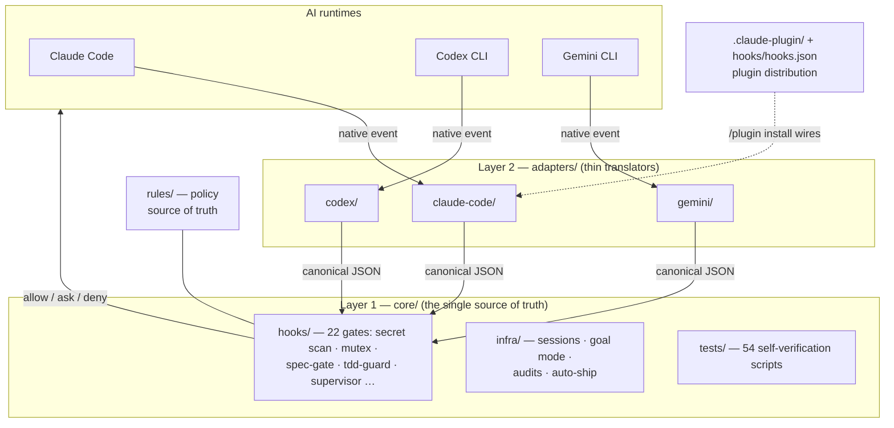
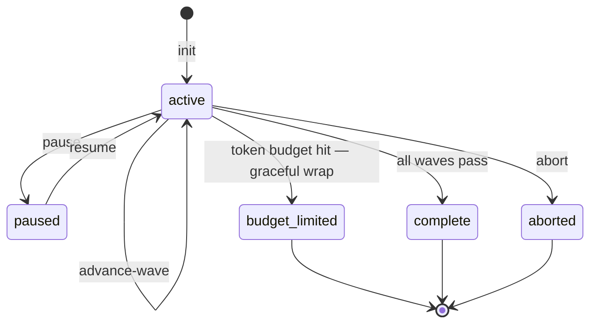
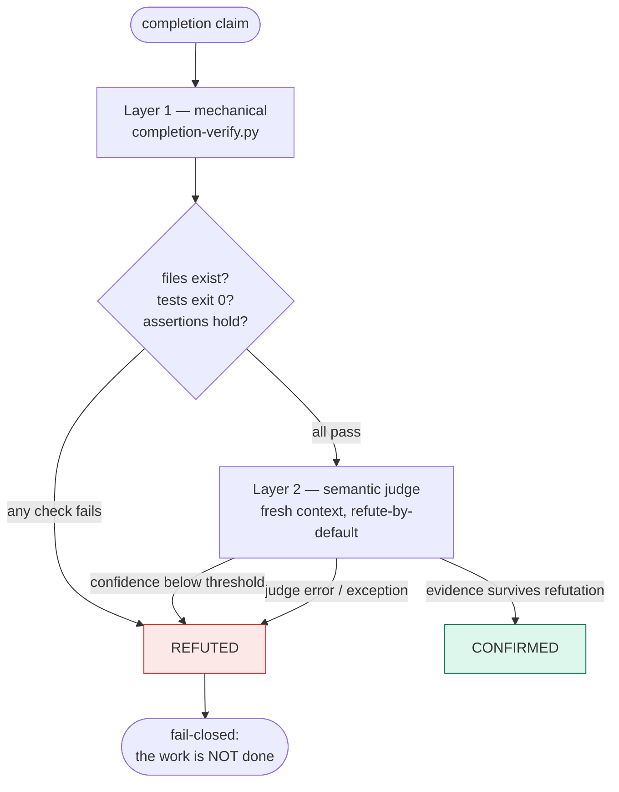
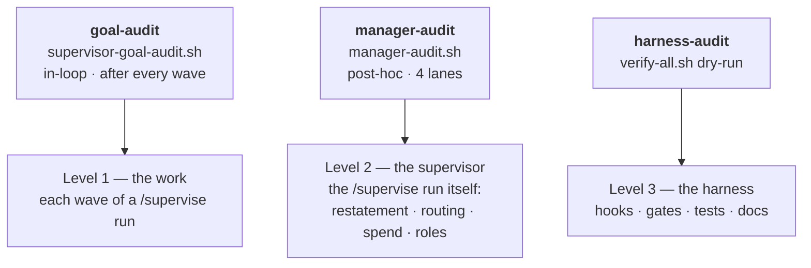

# Agent

[](LICENSE)


**English** | [한국어](README.ko.md)

**Agent is a safety harness for AI coding agents.** Think of a climbing harness: your AI
(Claude Code, Codex CLI, or Gemini CLI) does the climbing — writes code, runs commands,
opens PRs — and the harness stops it from falling: committing secrets, colliding with
another AI session, skipping tests, or touching things it shouldn't.

Install it once as a **Claude Code plugin** (or via a shell script for all three CLIs) and
every project gets the same decision core. The rules are written once: when an event
reaches the core, it returns the same **allow / ask / deny** answer no matter which AI is
driving — machine-tested by `core/tests/adapter-parity.sh`. What *differs* per runtime is
how much of the CLI's activity reaches that core; see
[Runtime coverage](#runtime-coverage).

> Status: v0.5.5 · License: **MIT**

---

## The pipeline

One idea travels through five skills. Between every two stages stands a **machine gate**
(hexagons below) — a script that blocks, not a prompt that suggests.

```mermaid
flowchart LR
    IDEA(["idea /<br/>request"]) --> SPEC["<b>/spec</b><br/>brainstorm →<br/>spec.md + plan.md"]
    SPEC --> G1{{"spec-gate.py<br/>no approved plan,<br/>no substantive edits"}}
    G1 --> SUP["<b>/supervise</b><br/>wave-by-wave dispatch<br/>to specialist agents"]
    SUP --> G2{{"supervisor-goal-audit.sh<br/>every wave audited<br/>FAIL = STOP, no auto-retry"}}
    G2 --> VER["<b>/verify-completion</b><br/>mechanical checks +<br/>refute-by-default judge"]
    VER --> G3{{"gitleaks +<br/>risk-area gates"}}
    G3 --> WRAP["<b>/wrap</b><br/>commit + PR"]
    WRAP -.-> MA["<b>/manager-audit</b><br/>post-hoc: did the<br/>supervisor do its job?"]
    MA -.-> PROP(["PROPOSALS.md<br/>patches await<br/>your approval"])

    style G1 fill:#fdf6b2,stroke:#b45309
    style G2 fill:#fdf6b2,stroke:#b45309
    style G3 fill:#fdf6b2,stroke:#b45309
```



Deep dives on each stage: [`skills/`](skills/) · state machine and audit internals in
[How a run flows](#how-a-run-flows) below.

## Why this harness

Table stakes first: multi-session mutexes, 6-layer secret hardening, and TDD enforcement
are all here (see [Catalog](#catalog)). What actually sets this harness apart:

**Gates, not vibes** — enforcement lives at the tool boundary, not in prompt wording.

- `core/hooks/pre-tool-guard.sh` physically blocks the edit or command at the tool
  boundary; the AI cannot talk its way past it.
- `core/hooks/spec-gate.py` and `core/hooks/tdd-guard.py` are the same kind of gate but
  ship in **observation mode**: `AGENT_SPEC_GATE_MODE` / `AGENT_TDD_GUARD_MODE` accept
  `off | dryrun | block`, and the default `dryrun` only logs the would-block verdict.
  Set `block` to enforce.
- Completion claims are verified **refute-by-default**: mechanical checks plus a semantic
  judge where low confidence and even judge crashes all resolve to REFUTED (fail-closed) —
  see the [verification diagram](#how-a-run-flows).
- Cross-AI parity is machine-proved, not promised: `core/tests/adapter-parity.sh` feeds the
  same events through all three adapters and asserts identical decisions. That proves
  *decision* parity; *event coverage* still differs per runtime — see
  [Runtime coverage](#runtime-coverage).

**The harness gates itself** — every enforcement layer is watched by another layer.

- [`docs/gate-registry.md`](docs/gate-registry.md) records, for every gate, *the model
  weakness it assumes* plus a review date, and flags gates as DEAD / FATIGUE / STALE when
  those assumptions expire — the gates are themselves gated.
- Three audits at three altitudes: goal-audit checks each wave, manager-audit checks the
  supervisor, harness-audit checks the harness — see the
  [audit diagram](#how-a-run-flows).
- This README is CI-verified: `core/tests/doc-reality.sh` fails the build if any doc names
  a file that doesn't exist. The docs are not allowed to lie.

**Honest economics** — cost and limits are designed in, not papered over.

- Model-tier routing ([`docs/model-routing.md`](docs/model-routing.md)): LOW / MID / TOP
  with "effort before tier-up" — and the decision to *reject* runtime model-switching is
  itself documented, with reasons.
- Goal mode survives session death: a SQLite state machine
  (`core/infra/supervisor-goal.sh`) tracks waves and token budgets, and resumes exactly
  where it stopped — including a graceful `budget_limited` wrap-up.
- The [self-benchmark](#benchmark) admits a near-tie with a rival stack. An honest audit
  log beats a marketing page.

## Concepts in 60 seconds

New to this space? These ten terms are all you need to read the rest of this page.

| Term | Plain meaning |
|---|---|
| **harness** | The whole safety layer: agents + hooks + skills + rules, wrapped around your AI. |
| **hook** | A small script your AI runtime runs automatically before/after an action. It answers **allow**, **ask**, or **deny**. 22 of them (plus 2 shared modules) live in [`core/hooks/`](core/hooks/). |
| **adapter** | A thin translator between one AI CLI's native event format and the harness's canonical JSON. There are 3 ([`adapters/`](adapters/)). |
| **agent** | A specialist your AI delegates to — e.g. a security reviewer that only reviews and never writes. 2 ship here ([`agents/`](agents/)). |
| **skill** | A reusable step-by-step workflow the AI follows, e.g. the commit + PR flow. 8 ship here ([`skills/`](skills/)). |
| **gate** | A hook decision point (deny / ask / block). Every gate is registered with the model weakness it assumes — [`docs/gate-registry.md`](docs/gate-registry.md). |
| **wave** | One batch of work inside a `/supervise` plan — dispatched, executed, and audited before the next wave starts. |
| **verdict** | The shared CONFIRMED / REFUTED result schema every verifier emits — [`docs/scoring-convention.md`](docs/scoring-convention.md). |
| **plan-gate** | A hook that classifies your prompt and forces a written plan before risky, multi-step work. |
| **mutex** | A lock file so two AI sessions never touch the same risky area (prod DB, deploys, payments) at once. |

More depth: [`docs/concepts/`](docs/concepts/).

## Runtime coverage

Decision parity is proven at the core: the same event produces the same verdict on every
runtime. Event *coverage* — how much of each CLI's activity is routed through that core —
is **not** identical, and this is the honest table:

| Capability | Claude Code | Codex CLI | Gemini CLI |
|---|---|---|---|
| PreToolUse: shell commands | native hooks | shell wrapper | shell wrapper |
| PreToolUse: native file-write tools | native hooks | not intercepted | not intercepted |
| PostToolUse | native hooks | none | none |
| Session lifecycle | native hooks | simulated (`core/infra/codex-session.sh`) | simulated (`core/infra/gemini-session.sh`) |

Per-runtime details and workarounds:
[`adapters/codex/README.md`](adapters/codex/README.md) ·
[`adapters/gemini/README.md`](adapters/gemini/README.md).

## Prerequisites

Required:

- `git` 2.30+
- `bash` 5.0+ (macOS ships 3.2 — `brew install bash`)
- `python3` 3.9+ (several hooks are Python scripts)
- At least one AI CLI: [Claude Code](https://claude.com/claude-code), Codex CLI, or Gemini CLI

Optional:

- `gitleaks` 8+ — secret scanning. If missing, hooks skip the secret-scan step (CI still enforces it).
- `gh` 2.0+ — for repo operations and `auto-ship.sh`.
- `sqlite3` + `jq` — required only for `/supervise --goal-mode`
  (`core/infra/supervisor-goal.sh` exits with an error without them; macOS
  ships sqlite3, Debian/Ubuntu need `apt install sqlite3 jq`). The
  manager-audit token lane degrades gracefully when they're missing.

Run `bash setup.sh --doctor` any time to check all of the above plus hook/adapter
executable bits and registry integrity — read-only, no installs.

## Quick start

Two install paths — both wire up the same core:

| You… | Take |
|---|---|
| use Claude Code | **Path A** — plugin (about 1 minute) |
| also (or only) drive Codex CLI / Gemini CLI, or prefer no plugin system | **Path B** — shell install |

Not sure? Take Path A.

### Path A — Claude Code plugin (recommended)

```
/plugin marketplace add joymin5655/Agent
/plugin install agent-harness@agent
```

Then:

1. **Restart Claude Code.** Agents and hooks load at session start.
2. **Verify.** Run `/plugin` — `agent-harness` shows *enabled*. In a new session the agents resolve as `agent-harness:code-reviewer`, `agent-harness:security-reviewer`, and `/project-init` is available.
3. **Scaffold a project.** Inside any repo, run `/project-init` to generate `CLAUDE.md`, rules, and `gitleaks.toml`.
4. *(Optional)* In a repo that already runs another hook-heavy plugin, disable agent-harness there via `/plugin` — agents stay namespaced as `agent-harness:*`, so there's no collision either way.

The plugin bundles: **2 agents**, **8 skills**, the hook set, and the `/project-init` command.

### Path B — shell install (Codex CLI / Gemini CLI / all three)

```bash
gh repo clone joymin5655/Agent ~/agent   # or: git clone https://github.com/joymin5655/Agent ~/agent
bash ~/agent/setup.sh                    # no flag = all three AIs
```

| Flag | Installs |
|---|---|
| `--claude` | Claude Code only (`~/.claude/settings.json`) |
| `--codex` | Codex CLI only (`~/.codex/config.toml`) |
| `--gemini` | Gemini CLI only (`~/.gemini/settings.json`) |
| `--project` | Scaffold the current repo: `CLAUDE.md` / `AGENTS.md` / `GEMINI.md` / `gitleaks.toml` / `hook-config.yml` / git pre-commit + pre-push hooks |
| `--hooks-only` | git-hooks only, no AI configs |
| `--all` | Everything above |

Flags combine (`bash setup.sh --claude --project`). Idempotent — existing files are
skipped; when a file would be replaced, setup asks interactively. Set `AGENT_SETUP_YES=1`
for non-interactive runs. There is no `--force` flag.

## See it work

Ask your AI to read a file under `secrets/`:

```
🚫 Tool blocked: Direct secrets/ access blocked. Use environment variable.
```

That exact block fires under Claude Code, Codex CLI, and Gemini CLI — same script, same
decision. That's the whole point.

## Architecture

One canonical hook protocol; thin per-AI adapters translate native events to it. Write a
guard once in `core/hooks/`, and it returns the same `allow` / `ask` / `deny` decision
everywhere.



Four layers, lowest wins:

- **L1 `core/`** — AI-agnostic hooks and infra. The single source of truth.
- **L2 `adapters/`** — per-AI translators (claude-code is a thin pass-through; codex and gemini do real translation).
- **L3 `templates/`** — project scaffolds that `setup.sh --project` / `/project-init` copy in.
- **L4 your project** — overrides via `hook-config.yml` and optional `.agent/` files. No core edits needed.

A `pre-tool-guard.sh` written once works for all 3 AIs. Adding a new AI runtime means
writing one new adapter — `core/hooks/*` doesn't change.
See [`docs/hook-protocol.md`](docs/hook-protocol.md) for the canonical event schema, and
[Determinism and model-invariance](docs/architecture.md#determinism-and-model-invariance)
for exactly what's guaranteed identical across AIs/models (the gates) versus what isn't
(generated content).

## How a run flows

Three internals worth seeing once. Click to expand.

<details>
<summary><b>Goal mode — a run that survives session death</b> (SQLite state machine)</summary>

`/supervise <slug> --goal-mode` backs the run with a SQLite state machine
(`core/infra/supervisor-goal.sh`). Kill the terminal mid-run, come back tomorrow,
`resume` — it continues from the exact wave it stopped at. Token budgets are tracked
per run; hitting the budget triggers a graceful wrap, not a crash.



Policy: [`rules/policy/supervisor-goal-mode.md`](rules/policy/supervisor-goal-mode.md).

</details>

<details>
<summary><b>Verification — refute-by-default, fail-closed</b> (two layers, every REFUTED path converges)</summary>

"Done" is a claim until it survives two layers. Layer 1 is deterministic
(`core/infra/completion-verify.py`); Layer 2 is a semantic judge spawned in a **fresh
context** whose default verdict is REFUTED. Low confidence → REFUTED. Judge crashes →
REFUTED. Nothing ambiguous ever becomes CONFIRMED.



Verdicts use the shared schema in [`docs/scoring-convention.md`](docs/scoring-convention.md),
so the completion verifier, goal-audit scorer, and eval harness all speak one format.

</details>

<details>
<summary><b>Triple audit — who audits the auditor</b> (three audits, three altitudes)</summary>

Each audit watches a *different* layer, so no layer grades its own homework.



And the gates themselves age: [`docs/gate-registry.md`](docs/gate-registry.md) marks a gate
DEAD / FATIGUE / STALE when the model weakness it was built for no longer exists.
Manager-audit findings never self-apply — they land in a `PROPOSALS.md` for your approval.

</details>

## Catalog

| Agents (`agents/`) | Model | Mode | Role |
|---|---|---|---|
| `code-reviewer` | sonnet | read-only | Reviews diffs; defers security to security-reviewer |
| `security-reviewer` | opus | read-only | OWASP Top 10, secrets, auth, injection — owns security findings |

Model is cost-tiered per work class ([`docs/model-routing.md`](docs/model-routing.md) is the cross-runtime policy): judgment — planning, orchestration decisions, result synthesis — inherits the session's top model (no `model:` pin); the two reviewer pins above are kept in sync with `agents/master-registry.json` by a CI drift guard (the only machine-enforced part); implementation dispatches at the workhorse tier and mechanical work at the low tier via an explicit per-call `model` override — documented conventions. Read-only agents are enforced read-only (no `Write`/`Edit`/`Bash`). Specialize any of them per project with `.agent/` files — see [`docs/specializing-agents.md`](docs/specializing-agents.md).

| Skills (`skills/`) | Trigger |
|---|---|
| `spec` | Upstream planning discipline — idea → reviewable spec before risky work (paired with the spec-gate hook) |
| `supervise` | Delegate a plan to autonomous execution |
| `verify-completion` | Independently re-verify a completion claim (deterministic checks + refute-by-default judge) |
| `wrap` | Commit + PR automation with safeguards |
| `brain-ingest` | Distill raw session captures into curated brain notes behind a deterministic lint gate |
| `harness-audit` | Read-only health check of the harness itself (one `verify-all.sh` dry-run, interpreted) |
| `manager-audit` | Meta-audit of a `/supervise` run — restatement quality, model-routing waste, relative token spend, role compliance; findings become patch proposals for user approval |
| `harness-help` | Router — which skill fits the situation, and the main flow through them |

| Hooks — 22 (+2 shared modules), wired via `hooks/hooks.json` → `core/hooks/` | Event |
|---|---|
| secret-content-scan · check-hardcoding | PreToolUse (Write/Edit) |
| pre-tool-guard · r4-mutex · context-mode-guard | PreToolUse |
| tdd-guard · spec-gate · supervisor · plan-scope-allow | PreToolUse (Write/Edit) |
| session heartbeat | UserPromptSubmit |
| plan-gate · model-routing-observer | PostToolUse (ExitPlanMode/Task/Agent) |
| session-quality-gate · brain-capture · session-close | Stop |

Command: **`/project-init`** scaffolds project-level files (`CLAUDE.md`, rules, `gitleaks.toml`).

## Layout

```
Agent/
├── .claude-plugin/     # Claude Code plugin + marketplace manifests
├── setup.sh            # shell installer — 6 combinable flags
├── gitleaks.toml       # base secret-scan config
├── AGENTS.md           # operating rules for AIs working on this repo
├── CHANGELOG.md
│
├── agents/             # 2 agent definitions + master-registry.json
├── skills/             # 8 skills (spec · supervise · verify-completion · wrap · brain-ingest · harness-audit · manager-audit · harness-help)
├── commands/           # 1 slash command (/project-init)
├── hooks/              # plugin hook wiring (hooks.json)
│
├── core/               # AI-agnostic core — the truth
│   ├── hooks/          #   22 portable hooks + 2 shared modules
│   ├── infra/          #   session coordination · goal mode · audits · auto-ship
│   ├── git-hooks/      #   pre-commit · pre-push
│   └── tests/          #   54 test scripts (verify-all.sh runs them all)
│
├── adapters/           # claude-code (thin) · codex · gemini
├── rules/              # generic policy docs
├── templates/          # project scaffold templates
├── evals/              # judge + verifier eval datasets and runners
├── docs/               # architecture · protocol · guides · benchmark
└── github/             # PR template + workflow templates
```

## Benchmark

A self-benchmark on a fixture with **8 planted bugs**, scored blind by an independent opus judge:

| Stack | Detection | False positives |
|---|---|---|
| **agent-harness** (`code-reviewer` + `security-reviewer`) | **8/8** | **0** |
| **oh-my-claudecode** (bundled `code-reviewer`) | **8/8** | 1 (hedged) |

Honest read: a near-tie. The curated 2-agent pair was cleaner (zero false positives) and its
lane split held, but OMC's broad sweep surfaced 2 genuine extra defects the lanes missed.
Positioning in one line: this harness is a thin, zero-FP quality + governance lane; the long
tail is delegated to broader stacks. Full method and raw findings:
[`docs/benchmark/results.md`](docs/benchmark/results.md).

## What this is NOT

- **Not a deployable application** — this is a framework you adopt into your own project.
- **Not an AI runtime** — you bring your own (Claude Code, Codex, Gemini, etc.).
- **Not a replacement for `.claude/`** — it generates and supplements `.claude/`, `.codex/`, `.gemini/` configs.
- **Not opinionated about your code** — only about session coordination, secret hygiene, and policy enforcement. Your stack, language, and architecture are up to you.

## Verification

```bash
# Run everything in one command (every gate + battery + evals + gitleaks):
bash core/tests/verify-all.sh
# → === verify-all: N passed, 0 failed, 0 skipped ===
```

The individual checks, run on their own:

```bash
# 1) gitleaks runs clean
gitleaks detect --no-git --source . --config gitleaks.toml

# 2) domain-neutrality gate (also runs in CI)
bash core/tests/sanitize-audit.sh

# 3) cross-AI parity: same event → same decision across all 3 adapters
bash core/tests/adapter-parity.sh
# → === Parity: 24 passed, 0 failed ===

# 4) docs match the repo (phantom paths + fence balance)
bash core/tests/doc-reality.sh

# 5) config parsing + autosync hook
bash core/tests/hook-config-test.sh
bash core/tests/post-commit-autosync-test.sh

# 6) environment diagnosis — read-only, no installs
bash setup.sh --doctor
```

## Customization

`setup.sh --project` scaffolds a `hook-config.yml` that documents your project's policy shape:

```yaml
risk_areas:
  - id: data
    description: "Production database migrations and schema changes"
    paths: ["migrations/*.sql"]
    commands: ["psql.*production", "alembic upgrade"]
    decision: ask
  - id: secrets
    description: "Anything touching secrets/ or .env"
    paths: ["secrets/*", ".env*"]
    decision: deny
  # ... add your own
```

That `risk_areas:` block is declarative — a documented record of your project's policy.
Enforcement of it today lives in each hook script's own hardcoded patterns
(`core/hooks/pre-tool-guard.sh`, `core/hooks/r4-mutex-check.sh`), not a dynamic read of this
file. The one mechanism that *is* dynamically loaded per project is the secret-scan pattern
extension, via `.agent/hook-config.yml`. Full schema and the real-vs-documented split:
[`docs/customization.md`](docs/customization.md). To sharpen the bundled agents for your stack
without forking them, drop optional files into `.agent/` —
see [`docs/specializing-agents.md`](docs/specializing-agents.md).

## Docs

- [`docs/getting-started.md`](docs/getting-started.md) — 5-minute install walkthrough
- [`docs/architecture.md`](docs/architecture.md) — the 4-layer model in depth
- [`docs/hook-protocol.md`](docs/hook-protocol.md) — canonical event schema (write your own hooks)
- [`docs/customization.md`](docs/customization.md) — risk areas and per-project config
- [`docs/specializing-agents.md`](docs/specializing-agents.md) — per-project agent injection
- [`docs/model-routing.md`](docs/model-routing.md) — cross-runtime model-tier policy (judgment vs execution, floors)
- [`docs/gate-registry.md`](docs/gate-registry.md) — every gate, its assumed model weakness, and its freshness verdict
- [`docs/scoring-convention.md`](docs/scoring-convention.md) — the shared verifier verdict schema
- [`docs/benchmark/results.md`](docs/benchmark/results.md) — reviewer self-benchmark
- [`docs/benchmark/landscape.md`](docs/benchmark/landscape.md) — survey vs popular harnesses + gap→backlog map
- [`docs/harness-improvement-plan.md`](docs/harness-improvement-plan.md) — audit + improvement roadmap *(Korean)*
- Migrating from the pre-2026-05 mirror? The v0 mirror left the shipped tree in 0.2.9 (its retired agent providers were a ghost-specialist trap). It lives on the `archive/v0-mirror` tag: `git show archive/v0-mirror:legacy/v0-mirror-2026-05-12/ARCHIVE-NOTE.md`.

## Contributing

See [`docs/getting-started.md`](docs/getting-started.md) and [`rules/contributing.md`](rules/contributing.md).

## License

[MIT](LICENSE) © joymin ([@joymin5655](https://github.com/joymin5655)).
