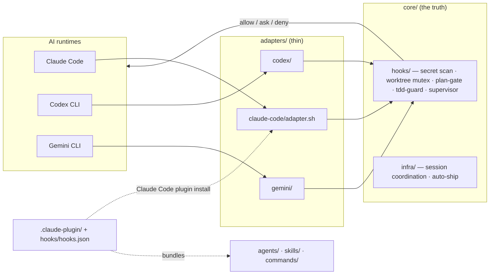

# Agent

[](LICENSE)


**English** | [한국어](README.ko.md)

**Agent is a safety harness for AI coding agents.** Think of a climbing harness: your AI
(Claude Code, Codex CLI, or Gemini CLI) does the climbing — writes code, runs commands,
opens PRs — and the harness stops it from falling: committing secrets, colliding with
another AI session, skipping tests, or touching things it shouldn't.

Install it once as a **Claude Code plugin** (or via a shell script for all three CLIs) and
every project gets the same guardrails. The rules are written once and return the same
**allow / ask / deny** answer no matter which AI is driving.

> Status: v0.2.0 · License: **MIT**

---

## Concepts in 60 seconds

New to this space? These seven terms are all you need to read the rest of this page.

| Term | Plain meaning |
|---|---|
| **harness** | The whole safety layer: agents + hooks + skills + rules, wrapped around your AI. |
| **hook** | A small script your AI runtime runs automatically before/after an action. It answers **allow**, **ask**, or **deny**. 17 of them live in [`core/hooks/`](core/hooks/). |
| **adapter** | A thin translator between one AI CLI's native event format and the harness's canonical JSON. There are 3 ([`adapters/`](adapters/)). |
| **agent** | A specialist your AI delegates to — e.g. a security reviewer that only reviews and never writes. 2 ship here ([`agents/`](agents/)). |
| **skill** | A reusable step-by-step workflow the AI follows, e.g. the commit + PR flow. 2 ship here ([`skills/`](skills/)). |
| **plan-gate** | A hook that classifies your prompt and forces a written plan before risky, multi-step work. |
| **mutex** | A lock file so two AI sessions never touch the same risky area (prod DB, deploys, payments) at once. |

More depth: [`docs/concepts/`](docs/concepts/).

## What you get

1. **Multi-session safety** — Claude in one terminal, Codex in another: they don't collide. Locks on shared resources are coordinated through a single JSON lock file.
2. **Secret hardening** — a 6-layer defense (`gitleaks` config + pre-commit + pre-push + Bash/MCP content scanners + policy doc + CI). Catches OpenAI/Anthropic/AWS/Stripe/Slack/Supabase + custom tokens in code, env files, MCP tool calls, and push diffs.
3. **Plan-first discipline** — hooks classify your prompt by tier (trivial / interactive / autonomous / conversational) and gate destructive operations behind a plan.
4. **Test-Driven enforcement** — `tdd-guard` blocks new production code unless a corresponding test file exists.
5. **Policy enforcement** — generic `.claude/rules/`-style policy docs: contributing, public-repo safety, memory discipline, worktree coordination, 5 configurable risk areas.
6. **Worktree coordination** — `core/infra/agent-session.sh` for branch-per-task discipline with stale-session GC and heartbeats.
7. **Commit + PR automation** — `auto-ship.sh` runs gitleaks + risk-area checks + CI watch + merge in one command; aborts if any safeguard trips.
8. **Cross-AI parity** — the same `core/hooks/*` script returns the same decision under all three AIs.

## Prerequisites

Required:

- `git` 2.30+
- `bash` 5.0+ (macOS ships 3.2 — `brew install bash`)
- `python3` 3.9+ (several hooks are Python scripts)
- At least one AI CLI: [Claude Code](https://claude.com/claude-code), Codex CLI, or Gemini CLI

Optional:

- `gitleaks` 8+ — secret scanning. If missing, hooks skip the secret-scan step (CI still enforces it).
- `gh` 2.0+ — for repo operations and `auto-ship.sh`.

Run `bash setup.sh --doctor` any time to check all of the above plus hook/adapter
executable bits and registry integrity — read-only, no installs.

## Quick start

Two install paths — both wire up the same core:

| You… | Take |
|---|---|
| use Claude Code | **Path A** — plugin (about 1 minute) |
| also (or only) drive Codex CLI / Gemini CLI, or prefer no plugin system | **Path B** — shell install |

Not sure? Take Path A.

### Path A — Claude Code plugin (recommended)

```
/plugin marketplace add joymin5655/Agent
/plugin install agent-harness@agent
```

Then:

1. **Restart Claude Code.** Agents and hooks load at session start.
2. **Verify.** Run `/plugin` — `agent-harness` shows *enabled*. In a new session the agents resolve as `agent-harness:code-reviewer`, `agent-harness:security-reviewer`, and `/project-init` is available.
3. **Scaffold a project.** Inside any repo, run `/project-init` to generate `CLAUDE.md`, rules, and `gitleaks.toml`.
4. *(Optional)* In a repo that already runs another hook-heavy plugin, disable agent-harness there via `/plugin` — agents stay namespaced as `agent-harness:*`, so there's no collision either way.

The plugin bundles: **2 agents**, **2 skills**, the hook set, and the `/project-init` command.

### Path B — shell install (Codex CLI / Gemini CLI / all three)

```bash
gh repo clone joymin5655/Agent ~/agent   # or: git clone https://github.com/joymin5655/Agent ~/agent
bash ~/agent/setup.sh                    # no flag = all three AIs
```

| Flag | Installs |
|---|---|
| `--claude` | Claude Code only (`~/.claude/settings.json`) |
| `--codex` | Codex CLI only (`~/.codex/config.toml`) |
| `--gemini` | Gemini CLI only (`~/.gemini/settings.json`) |
| `--project` | Scaffold the current repo: `CLAUDE.md` / `AGENTS.md` / `GEMINI.md` / `gitleaks.toml` / `hook-config.yml` / git pre-commit + pre-push hooks |
| `--hooks-only` | git-hooks only, no AI configs |
| `--all` | Everything above |

Flags combine (`bash setup.sh --claude --project`). Idempotent — existing files are
skipped; when a file would be replaced, setup asks interactively. Set `AGENT_SETUP_YES=1`
for non-interactive runs. There is no `--force` flag.

## See it work

Ask your AI to read a file under `secrets/`:

```
🚫 Tool blocked: Direct secrets/ access blocked. Use environment variable.
```

That exact block fires under Claude Code, Codex CLI, and Gemini CLI — same script, same
decision. That's the whole point.

## Architecture

One canonical hook protocol; thin per-AI adapters translate native events to it. Write a guard
once in `core/hooks/`, and it returns the same `allow` / `ask` / `deny` decision everywhere.



Four layers, lowest wins:

- **L1 `core/`** — AI-agnostic hooks and infra. The single source of truth.
- **L2 `adapters/`** — per-AI translators (claude-code is a thin pass-through; codex and gemini do real translation).
- **L3 `templates/`** — project scaffolds that `setup.sh --project` / `/project-init` copy in.
- **L4 your project** — overrides via `hook-config.yml` and optional `.agent/` files. No core edits needed.

The **Claude Code plugin** (`.claude-plugin/`) wires the same core through `hooks/hooks.json` and
bundles the agents/skills/commands — so `/plugin install` gives you the whole harness with zero setup.

## Catalog

| Agents (`agents/`) | Model | Mode | Role |
|---|---|---|---|
| `code-reviewer` | sonnet | read-only | Reviews diffs; defers security to security-reviewer |
| `security-reviewer` | opus | read-only | OWASP Top 10, secrets, auth, injection — owns security findings |

Model is cost-tiered per role (planning/design → inherit the session's top model (no `model:` pin), security review → opus, code review/execution → sonnet, mechanical → haiku) and kept in sync with `agents/master-registry.json` by a CI drift guard. Read-only agents are enforced read-only (no `Write`/`Edit`/`Bash`). Specialize any of them per project with `.agent/` files — see [`docs/specializing-agents.md`](docs/specializing-agents.md).

| Skills (`skills/`) | Trigger |
|---|---|
| `supervise` | Delegate a plan to autonomous execution |
| `wrap` | Commit + PR automation with safeguards |

| Hooks — 17, wired via `hooks/hooks.json` → `core/hooks/` | Event |
|---|---|
| secret-content-scan · check-hardcoding | PreToolUse (Write/Edit) |
| pre-tool-guard · r4-mutex · context-mode-guard | PreToolUse |
| tdd-guard · supervisor | PreToolUse (Write/Edit) |
| session heartbeat | UserPromptSubmit |
| plan-gate | PostToolUse (ExitPlanMode/Task/Agent) |
| session-quality-gate · session-close | Stop |

Command: **`/project-init`** scaffolds project-level files (`CLAUDE.md`, rules, `gitleaks.toml`).

## Layout

```
Agent/
├── .claude-plugin/     # Claude Code plugin + marketplace manifests
├── setup.sh            # shell installer — 6 combinable flags
├── gitleaks.toml       # base secret-scan config
├── AGENTS.md           # operating rules for AIs working on this repo
├── CHANGELOG.md
│
├── agents/             # 2 agent definitions + master-registry.json
├── skills/             # 2 skills (supervise · wrap)
├── commands/           # 1 slash command (/project-init)
├── hooks/              # plugin hook wiring (hooks.json)
│
├── core/               # AI-agnostic core — the truth
│   ├── hooks/          #   17 portable hooks + hook_config.py (shared module)
│   ├── infra/          #   session coordination · auto-ship · goal mode
│   ├── git-hooks/      #   pre-commit · pre-push
│   └── tests/          #   4 test scripts
│
├── adapters/           # claude-code (thin) · codex · gemini
├── rules/              # generic policy docs
├── templates/          # project scaffold templates
├── docs/               # architecture · protocol · guides · benchmark
├── github/             # PR template + workflow templates
└── legacy/             # archived v0 mirror (out of scope)
```

## Why "AI-agnostic"?

One hook protocol, three adapters:

```
 [AI runtime]  Claude / Codex / Gemini
      │  native hook event
      ▼
 [adapter]  translates to canonical stdin JSON
      ▼
 [core/hooks/<name>]  decides once
      ▼
 [adapter]  translates back to the AI's native format
      ▼
 [AI runtime enforces]  allow / ask / deny
```

A `pre-tool-guard.sh` written once works for all 3 AIs. Adding a new AI runtime means
writing one new adapter — `core/hooks/*` doesn't change.
See [`docs/hook-protocol.md`](docs/hook-protocol.md) for the canonical event schema, and
[Determinism and model-invariance](docs/architecture.md#determinism-and-model-invariance)
for exactly what's guaranteed identical across AIs/models (the gates) versus what isn't
(generated content).

## Benchmark

A self-benchmark on a fixture with **8 planted bugs**, scored blind by an independent opus judge:

| Stack | Detection | False positives |
|---|---|---|
| **agent-harness** (`code-reviewer` + `security-reviewer`) | **8/8** | **0** |
| **oh-my-claudecode** (bundled `code-reviewer`) | **8/8** | 1 (hedged) |

Honest read: a near-tie. The curated 2-agent pair was cleaner (zero false positives) and its
lane split held, but OMC's broad sweep surfaced 2 genuine extra defects the lanes missed.
Positioning in one line: this harness is a thin, zero-FP quality + governance lane; the long
tail is delegated to broader stacks. Full method and raw findings:
[`docs/benchmark/results.md`](docs/benchmark/results.md).

## What this is NOT

- **Not a deployable application** — this is a framework you adopt into your own project.
- **Not an AI runtime** — you bring your own (Claude Code, Codex, Gemini, etc.).
- **Not a replacement for `.claude/`** — it generates and supplements `.claude/`, `.codex/`, `.gemini/` configs.
- **Not opinionated about your code** — only about session coordination, secret hygiene, and policy enforcement. Your stack, language, and architecture are up to you.

## Verification

```bash
# 1) gitleaks runs clean
gitleaks detect --no-git --source . --config gitleaks.toml

# 2) domain-neutrality gate (also runs in CI)
bash core/tests/sanitize-audit.sh

# 3) cross-AI parity: same event → same decision across all 3 adapters
bash core/tests/adapter-parity.sh
# → === Parity results: 6 passed, 0 failed ===

# 4) config parsing + autosync hook
bash core/tests/hook-config-test.sh
bash core/tests/post-commit-autosync-test.sh

# 5) environment diagnosis — read-only, no installs
bash setup.sh --doctor
```

## Customization

`setup.sh --project` scaffolds a `hook-config.yml` that documents your project's policy shape:

```yaml
risk_areas:
  - id: data
    description: "Production database migrations and schema changes"
    paths: ["migrations/*.sql"]
    commands: ["psql.*production", "alembic upgrade"]
    decision: ask
  - id: secrets
    description: "Anything touching secrets/ or .env"
    paths: ["secrets/*", ".env*"]
    decision: deny
  # ... add your own
```

That `risk_areas:` block is declarative — a documented record of your project's policy.
Enforcement of it today lives in each hook script's own hardcoded patterns
(`core/hooks/pre-tool-guard.sh`, `core/hooks/r4-mutex-check.sh`), not a dynamic read of this
file. The one mechanism that *is* dynamically loaded per project is the secret-scan pattern
extension, via `.agent/hook-config.yml`. Full schema and the real-vs-documented split:
[`docs/customization.md`](docs/customization.md). To sharpen the bundled agents for your stack
without forking them, drop optional files into `.agent/` —
see [`docs/specializing-agents.md`](docs/specializing-agents.md).

## Docs

- [`docs/getting-started.md`](docs/getting-started.md) — 5-minute install walkthrough
- [`docs/architecture.md`](docs/architecture.md) — the 4-layer model in depth
- [`docs/hook-protocol.md`](docs/hook-protocol.md) — canonical event schema (write your own hooks)
- [`docs/customization.md`](docs/customization.md) — risk areas and per-project config
- [`docs/specializing-agents.md`](docs/specializing-agents.md) — per-project agent injection
- [`docs/benchmark/results.md`](docs/benchmark/results.md) — reviewer self-benchmark
- [`docs/harness-improvement-plan.md`](docs/harness-improvement-plan.md) — audit + improvement roadmap *(Korean)*
- Migrating from the pre-2026-05 mirror? See [`legacy/v0-mirror-2026-05-12/ARCHIVE-NOTE.md`](legacy/v0-mirror-2026-05-12/ARCHIVE-NOTE.md).

## Contributing

See [`docs/getting-started.md`](docs/getting-started.md) and [`rules/contributing.md`](rules/contributing.md).

## License

[MIT](LICENSE) © joymin ([@joymin5655](https://github.com/joymin5655)).
