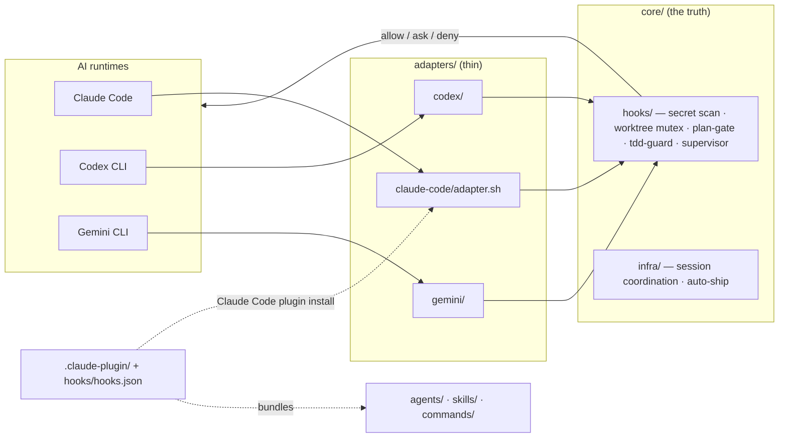

# Agent

[](LICENSE)


**A portable AI agent harness** — curated review/build/test agents, secret-hardening + worktree + plan-gate hooks, and supervise/tdd/diagnose/wrap skills. Install once as a **Claude Code plugin** and use it in every project. The core is AI-agnostic: the same hooks return the same decision under Claude Code, Codex CLI, and Gemini CLI.

> Status: v0.2.0. License: **MIT**. Installable as a Claude Code plugin (below) or as a shell framework for all 3 AIs.

---

## What this gives you

When you adopt this framework in a project, you get:

1. **Multi-session safety** — when you have multiple AI sessions running (Claude in one terminal, Codex in another, Gemini in a third), they don't collide. Locks on shared resources (production DBs, deploy commands, payment libraries) are coordinated through a single JSON lock file.
2. **Secret hardening** — a 6-layer secret defense (`gitleaks` config + pre-commit + pre-push + Bash/MCP content scanners + project policy doc + CI workflow). Catches OpenAI/Anthropic/AWS/Stripe/Slack/Supabase + custom tokens in code, env files, MCP tool calls, and `git push` diffs.
3. **Plan-first discipline** — hooks classify your prompt by tier (trivial / interactive / autonomous / conversational), gate destructive operations, and enforce a "think before coding" loop.
4. **Test-Driven enforcement** — a `tdd-guard` hook blocks creating new production code unless a corresponding test file exists.
5. **Policy enforcement** — generic `.claude/rules/` style policy docs covering contributing, public-repo safety, memory discipline, multi-agent worktree coordination, 5 project risk areas (configurable).
6. **Worktree coordination** — `scripts/infra/agent-session.sh` for branch-per-task discipline with automatic stale-session GC and heartbeat tracking.
7. **Commit + PR automation** — `auto-ship.sh` runs `gitleaks` + project-defined risk-area checks + CI watch + admin merge in one command. Aborts if any safeguard trips.
8. **Cross-AI parity** — the same `core/hooks/*` script returns the same decision (`allow` / `deny` / `ask`) no matter which AI invokes it. Adapters translate native AI events to a canonical JSON protocol.

---

## Quick start

### Install as a Claude Code plugin (recommended)

```
/plugin marketplace add joymin5655/Agent
/plugin install agent-harness@agent
```

That's it — every project gets the agents, skills, hooks, and the `/project-init`
command, with zero per-project setup. The plugin bundles:

- **agents** (`agents/`) — `architect`, `code-reviewer`, `security-reviewer`, `test-engineer`, `build-error-resolver`
- **skills** (`skills/`) — `supervise`, `tdd`, `diagnose`, `wrap`
- **hooks** (`hooks/hooks.json`) — secret-hardening, worktree mutex, plan-gate, TDD guard, supervisor dispatch, Stop-time quality gate
- **command** — `/project-init` to scaffold project-level files (`CLAUDE.md`, rules, `gitleaks.toml`)

To scaffold the current repo after installing: run `/project-init`.

### One-command install (all 3 AIs)

> Use this shell path if you also drive Codex CLI / Gemini CLI, or prefer not to use the plugin system.


```bash
gh repo clone joymin5655/Agent ~/agent
bash ~/agent/setup.sh
```

This installs adapter configs to:
- `~/.claude/settings.json` (Claude Code hook registration)
- `~/.codex/config.toml` (Codex CLI hook registration)
- `~/.gemini/settings.json` (Gemini CLI hook registration)

Existing configs are merged, not overwritten. Use `--force` to overwrite.

### Selective install

```bash
bash ~/agent/setup.sh --claude       # Claude Code only
bash ~/agent/setup.sh --codex        # Codex CLI only
bash ~/agent/setup.sh --gemini       # Gemini CLI only
bash ~/agent/setup.sh --hooks-only   # git-hooks only (no AI configs)
```

### Add to a project

```bash
cd /path/to/your/project
bash ~/agent/setup.sh --project
```

Scaffolds into the project:
- `CLAUDE.md` (if absent — generic template)
- `AGENTS.md` (if absent — generic template)
- `GEMINI.md` (if absent — generic template)
- `gitleaks.toml` (if absent)
- `.claude/rules/` (sanitized generic copies)
- `hook-config.yml` (project-customizable risk areas)
- `.gitignore` additions (runtime state)
- `.git/hooks/{pre-commit, pre-push}` (gitleaks + scan-push-diff)

Idempotent — re-running skips existing files (use `--force` to overwrite).

---

## What you need to do

The plugin install is the only **required** step. Full checklist:

1. **Install** (once, global):
   ```
   /plugin marketplace add joymin5655/Agent
   /plugin install agent-harness@agent
   ```
2. **Restart Claude Code.** Agents and hooks load at session start — they won't appear until you restart or open a new session.
3. **Verify.** Run `/plugin` (agent-harness shows *enabled*). In a new session the agents resolve as `agent-harness:architect`, `agent-harness:code-reviewer`, `agent-harness:security-reviewer`, `agent-harness:test-engineer`, `agent-harness:build-error-resolver` — and `/project-init` is available.
4. **(Optional) Avoid hook double-firing.** In a repo that already runs another hook-heavy agent plugin (e.g. oh-my-claudecode), this harness's secret/worktree/supervisor hooks overlap with it. Disable the agent-harness plugin in that one repo via `/plugin` — the agents still namespace cleanly as `agent-harness:*`, so there's no name collision either way.
5. **(Optional) Specialize per project.** Drop `.agent/threat-model.md` or `.agent/conventions.md` to sharpen the generic agents for your stack ([`docs/specializing-agents.md`](docs/specializing-agents.md)), or run `/project-init` to scaffold `CLAUDE.md` + rules + `gitleaks.toml`.

Driving Codex CLI / Gemini CLI too, or prefer no plugin system? Use the shell `setup.sh` path (**One-command install**, above) instead — it wires the same core into `~/.codex` and `~/.gemini` as well.

---

## Architecture

One canonical hook protocol; thin per-AI adapters translate native events to it. Write a guard
once in `core/hooks/`, and it returns the same `allow` / `ask` / `deny` decision everywhere.



The **Claude Code plugin** (`.claude-plugin/`) wires the same core through `hooks/hooks.json` and
bundles the agents/skills/commands — so `/plugin install` gives you the whole harness with zero setup.

## Catalog

| Agents (`agents/`) | Model | Mode | Role |
|---|---|---|---|
| `architect` | opus | read-only | Plans multi-file work; never writes code |
| `code-reviewer` | sonnet | read-only | Reviews diffs; defers security to security-reviewer |
| `security-reviewer` | opus | read-only | OWASP Top 10, secrets, auth, injection — owns security findings |
| `test-engineer` | sonnet | write | Writes/maintains tests, enforces red-green TDD |
| `build-error-resolver` | haiku | write | Minimal-diff fixes for build/type/lint errors |

Model is cost-tiered per role (deep review/design → opus, execution → sonnet, mechanical → haiku) and kept in sync with `agents/master-registry.json` by a CI drift guard. Read-only agents are enforced read-only (no `Write`/`Edit`/`Bash`). Specialize any of them per project with `.agent/` files — see [`docs/specializing-agents.md`](docs/specializing-agents.md).

| Skills (`skills/`) | Trigger |
|---|---|
| `supervise` | Delegate a plan to autonomous execution |
| `tdd` | Red-Green-Refactor enforcement |
| `diagnose` | Hard-to-reproduce bugs, missing feedback loop |
| `wrap` | Commit + PR automation with safeguards |

| Hooks (`hooks/hooks.json` → `core/hooks/`) | Event |
|---|---|
| secret-content-scan · check-hardcoding | PreToolUse (Write/Edit) |
| pre-tool-guard · r4-mutex · context-mode-guard | PreToolUse |
| tdd-guard · supervisor | PreToolUse (Write/Edit) |
| plan-gate · session heartbeat | UserPromptSubmit |
| session-quality-gate · session-close | Stop |

Command: **`/project-init`** scaffolds project-level files (`CLAUDE.md`, rules, `gitleaks.toml`).

## Layout

```
Agent/
├── .claude-plugin/              # Claude Code plugin + marketplace manifests
│   ├── plugin.json
│   └── marketplace.json
├── README.md                    # this file
├── AGENTS.md                    # agents.md spec, 3-AI guide
├── CHANGELOG.md
├── LICENSE                      # MIT
├── setup.sh                     # 4-mode installer (shell path)
├── gitleaks.toml                # base secret-scan config
├── .gitignore
│
├── commands/                   # slash commands (/project-init)
├── hooks/                      # plugin hook wiring (hooks.json → core/hooks via adapter)
│
├── docs/                        # concept + protocol docs
│   ├── architecture.md
│   ├── ai-adapters.md
│   ├── hook-protocol.md         # canonical stdin/stdout JSON
│   ├── getting-started.md
│   ├── customization.md
│   ├── specializing-agents.md   # per-project .agent/ injection points
│   └── concepts/
│
├── core/                        # AI-agnostic core (the truth)
│   ├── hooks/                   # ~25 portable hooks
│   ├── infra/                   # session coordination, auto-ship
│   ├── git-hooks/               # pre-commit, pre-push
│   └── tests/                   # hook + adapter tests
│
├── adapters/                    # 3 AI bridges
│   ├── claude-code/
│   ├── codex/
│   └── gemini/
│
├── rules/                       # generic policy docs
├── agents/                      # generic agent definitions (Claude format)
├── skills/                      # generic SKILL.md files (Claude format)
├── codex-skills/                # Codex-native skill format
├── templates/                   # project scaffold templates
│
├── github/
│   ├── workflows.template/      # secret-scan.yml, lint.yml
│   └── PULL_REQUEST_TEMPLATE.md
│
└── legacy/
    └── v0-mirror-2026-05-12/        # archived original mirror content
```

---

## Why "AI-agnostic"?

The core innovation: **one hook protocol, three adapters**.

```
                     [Your AI runtime]
                            │
                  Claude / Codex / Gemini
                            │
                    [native hook event]
                            │
                            ▼
                    [adapter — translates]
                            │
                 canonical stdin JSON
                            │
                            ▼
                   [core/hooks/<name>]
                            │
                 canonical stdout JSON
                            │
                            ▼
                  [adapter — translates back]
                            │
                native decision (allow/deny/ask)
                            │
                            ▼
                  [AI runtime enforces]
```

A `pre-tool-guard.sh` written once works for all 3 AIs. When you add a new AI runtime, you only write a new adapter — `core/hooks/*` doesn't change.

See [`docs/hook-protocol.md`](docs/hook-protocol.md) for the canonical event schema.

---

## What this is NOT

- **Not a deployable application** — this is a framework you adopt into your own project.
- **Not an AI runtime** — you bring your own (Claude Code, Codex, Gemini, etc.).
- **Not a replacement for `.claude/`** — it generates and supplements `.claude/`, `.codex/`, `.gemini/` configs.
- **Not opinionated about your code** — only about session coordination, secret hygiene, and policy enforcement. Your project's stack, language, and architecture are up to you.

---

## Verification

After install:

```bash
# 1) gitleaks runs clean
gitleaks detect --no-git --source . --config gitleaks.toml

# 2) hook protocol smoke test (each AI)
bash core/tests/adapter-smoke/claude-code/run.sh
bash core/tests/adapter-smoke/codex/run.sh
bash core/tests/adapter-smoke/gemini/run.sh

# 3) cross-AI parity (same event → same decision across all 3 AIs)
bash core/tests/cross-ai-parity.sh
```

---

## Customization

Each project gets a `hook-config.yml` that defines:

```yaml
risk_areas:
  - id: production-data
    description: "Production database migrations and schema changes"
    paths: ["migrations/*.sql"]
    commands: ["psql.*production", "alembic upgrade"]
    decision: ask
  - id: secrets
    description: "Anything touching secrets/ or .env"
    paths: ["secrets/*", ".env*"]
    decision: deny
  # ... add your own
```

The same `core/hooks/r4-mutex-check.sh` reads this and enforces it. No code changes per project.

See [`docs/customization.md`](docs/customization.md) for the full schema.

To sharpen the bundled agents for your project — a Supabase threat model, code
conventions, a flake list — without forking them, drop optional files into
`.agent/`. See [`docs/specializing-agents.md`](docs/specializing-agents.md).

---

## Migration from legacy

If you were using the previous 2026-05-12 mirror version, see [`legacy/v0-mirror-2026-05-12/ARCHIVE-NOTE.md`](legacy/v0-mirror-2026-05-12/ARCHIVE-NOTE.md) for the migration map.

---

## Contributing

See [`docs/getting-started.md`](docs/getting-started.md) and [`rules/contributing.md`](rules/contributing.md).

## License

[MIT](LICENSE) © joymin ([@joymin5655](https://github.com/joymin5655)).
